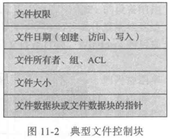
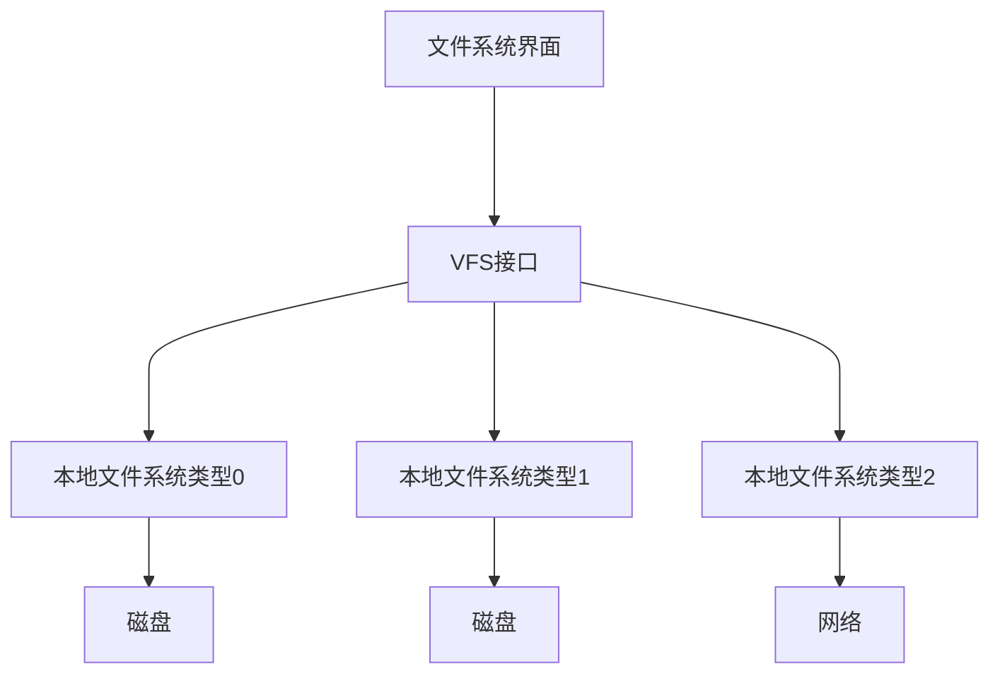
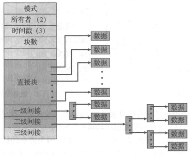
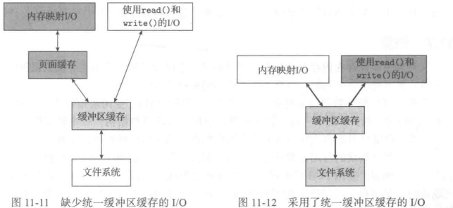
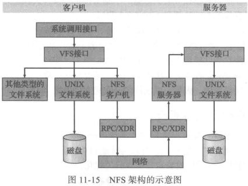
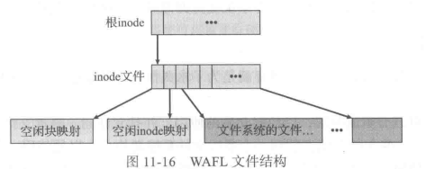
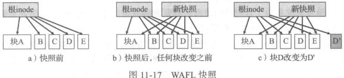

## FileSystemImplement

>   磁盘提供大多数的外存 以维护文件系统

优势

-   原地重写
-   直接访问包含信息的任何块

内存和磁盘之间IO传输以**块(block)**为单位执行

>   FileSystem提供高效和便捷的磁盘访问

涉及问题

-   文件系统的用户接口定义
    -   文件及其属性
    -   文件操作
    -   组织文件的目录结构
-   创建算法和数据结构
    -   映射文件系统到物理外存设备

分层设计

| LFS    | Logical File System      | 逻辑文件系统 | 管理元数据信息 包括文件系统的所有结构 不包括实际数据    |
| ------ | ------------------------ | ------------ | ------------------------------------------------------- |
| FOM    | File-Organization Module | 文件组织模块 | 知道文件及其逻辑块和物理块                              |
| BFS    | Basic File System        | 基本文件系统 | 向适当设备驱动程序发送通用命令 以读取和写入磁盘的物理块 |
| I/OCtl | IO控制                   |              | 包括设备驱动程序和中断出护理程序                        |

不同系统的标准文件系统

| CD-ROM  | ISO 9660                         |
| ------- | -------------------------------- |
| Unix    | UNIX File System, USF            |
| Windows | Windows NT File System, NTFS     |
| Linux   | extended file system,  ext3/ext4 |

### FileSystemImp

文件系统可能信息

-   启动存储的操作系统方式
-   总块数
-   空闲块的数量和位置
-   目录结构
-   各个具体文件
-   ...

结构

-   (每个卷的)**引导控制块(boot control block)**可以包含从该卷引导操作系统的所需信息
    -   如果磁盘不包含操作系统 则这块的内容为空 
        -   它通常为卷的第一块
    -   UFS称之为引导块(boot block)
    -   NTFS称之为分区引导扇区(partition boot sector)
-   (每个卷的)**卷控制块(volume control block)**
    -   包括卷(或分区)的详细信息
        -   分区的块的数量
        -   块的大小
        -   空闲块的数量和指针
        -   空闲的FCB数量
        -   FCB指针等
    -   UFS称之为超级块(superblock)
    -   在NTFS中它存储在主控文件表(masterfiletable)中
-   (每个文件系统的)目录结构用于组织文件
    -   在UFS中，它包含文件名和相关的inode的号码
    -   在NTFS中，它存储在主控文件表中
-   每个文件的FCB包括该文件的许多详细信息
    -   它有一个唯一的标识号 以便与目录条目相关联
    -   在NTFS中 这些信息实际上存储在主控文件表中 它使用关系数据库结构 每个文件占一行

内存中的信息用于管理文件系统并通过缓存来提高性能

| 文件系统 | 内存信息变化 |
| -------- | ------------ |
| 安装     | 加载         |
| 操作     | 更新         |
| 卸载     | 丢弃         |

这些结构的类型

-   内存中的**安装表(mount table)**包含每个安装卷的有关信息
-   内存中的目录结构的缓存含有最近访问目录的信息(对于加载卷的目录，它可以包
    括一个指向卷表的指针)
-   **整个系统的打开文件表(system-wide open-file table)**包括每个打开文件的FCB的副本以及其他信息
-   **每个进程的打开文件表(per-process open-file table)**包括一个指向整个系统的打开文件表中的适当条目的指针，以及其他信息
-   当对磁盘读出或写入时 缓冲区保存文件系统的块

#### FileCreation

调用逻辑文件系统`->`分配一个新的FCB(逻辑文件系统知道目录结构格式)`->`系统将相应的目录读到内存 使用新文件名和FCB更新`->`写回磁盘

open:

-   在单个进程的打开文件表中创建一个条目

-   返回单个进程的打开文件表的一部分
-   完成FCB定位 被缓存起来

|          | UNIX            | Windows     |
| -------- | --------------- | ----------- |
| 条目名称 | File Descriptor | file handle |

#### Partition

磁盘的布局取决于操作系统

分区

-   raw
    -   没有文件系统
-   cooked
    -   含有文件系统

>   没有合适的文件系统时 可以使用原始磁盘(raw disk)

引导信息可以存储在各自分区中 有自己的格式 通常是一系列连续的块 可作为映像加载到内存

**引导加载程序(bootloader)**相应地了解足够的文件系统结构 从而能够找到并加载内核 并开始执行它。它不仅包括指令以便启动一个具体的操作系统

>   例如，许多系统可以**双重引导(dual-booted)**，允许我们在单个系统上安装多个操作系统

>   **Root Partition**:包含操作系统内核和其他系统文件

#### VFS

现代操作系统同时支持多个类型的文件系统

大多数操作系统采用面向对象的技术来简化 组织和模块化实现

>   Virtual File System

-   将通用操作和实现分开
    -   允许存在多个实现
    -   允许透明访问本地安装的不同类型的文件系统
-   提供唯一表示网络文件的机制
    -   基于(virtual/vnode)节点的文件表示结构
        -   包含一个数字指示符表示网络上的一个文件
    -   这种网络的唯一性需要用来支持网络文件系统
    -   内核为每个活动节点(文件或目录)保存一个vnode结构

VFS区分本地文件和远程文件

Linux VFS架构

4个主要对象类型

-   索引节点对象(inode object):表示一个单独的文件
-   文件对象(file object):表示一个已打开的文件
-   超级块对象(superblock object):表示整个文件系统
-   目录条目对象(dentry object):表示单个目录条目

文件对象操作

-   `int open`
-   `int close`
-   `ssize_t read`
-   `ssize_t write`
-   `int mmap`:内存映射一个文件

>   `/usr/include/linux/fs.h::file_operations`

### MemuImp

-   [线性列表](#LinearList)
-   [哈希表](#HashTable)

#### LinearList

>   最简单方法:采用文件名称和数据块指针的线性列表

| 缺点                 | 优点                                         |
| -------------------- | -------------------------------------------- |
| 查找文件需要线性搜索 | 不需要单独的排序步骤就可以生成排序的目录信息 |

#### HashTable

>   采用线性列表存储目录条目外 还采用了哈希数据结构

根据文件名获得一个值 返回线性列表内的一个元素指针

**主要问题 通常固定的大小和哈希函数对大小的依赖性**

解决方案

-   扩大范围重映射
-   chained-Hash:溢出链接的哈希表

### Alloc

分配的常用方法

-   [连续分配](#contiguous)
-   [链接分配](#linked)
-   [索引分配](#indexed)

>   更为常见的:一个系统只对同一个文件系统类型的所有文件采用一种方法

#### contiguous

>   每个文件在磁盘上占用一组连续的块

磁盘地址为磁盘定义了一个线性排序

用于访问连续分配文件的所需寻道数量最小
在确实需要寻道时所需的寻道时间也最小

>   问题:**为新文件找到空间**

可以作为通用**动态存储分配(dynamic storage-allocation)**问题的一个具体应用

都有**外部碎片**的问题

>   一个解决方案:初分配+拓展(extend)

#### linked

>   **链接分配(linked allocation)** 解决了连续分配的所有问题

问题

-   只能有效于顺序访问文件
-   指针所需空间

>   将多个块组成**簇(cluster)** 按簇分配

**文件分配表(File-Allocation Table, FAT)**

-   每个卷的开头部分的磁盘用于存储该表
-   每个磁盘块都有一个条目 按块号索引
-   未使用的块用0作为表条目的值来表示

#### indexed

>   **索引分配(indexed allocation)** 通过将所有指针放在一起 即**索引块(index block)** 解决连接分配的高效直接访问问题

每个文件都有自己的索引块 一个磁盘块地址的数组

索引分配支持直接访问 并且没有外部碎片空间问题

解决索引块大小问题

-   **链接方案**:一个索引块通常为一个磁盘块
    -   本身能直接读写
    -   可以将多个索引块链接起来
-   **多级索引**:通过第一级索引块指向一组第二级的索引块 又指向文件块
-   **组合方案**:
    -   将索引块的前几个指针存在文件的`inode`中
    -   前12个指针指向**直接块(direct block)**
        -   包含存储文件数据的块的地址
    -   接下来三个指针指向**间接块(indirect block)**
        -   第一个指向**一级间接块(single indirect block)**:索引块
        -   第二个指向**二级间接块(double indirect block)**:一个块的地址
            -   块内的地址指向了一些块
                -   块包含了指向真实数据块的指针
        -   第三个指向**三级间接块(triple indirect block)**

### Free-space Man

为了跟踪空闲磁盘空间 维护一个**空闲空间列表(free-space list)**

-   [位向量](#bit-vector)
-   [链表](#list)

#### bit vector

空闲空间列表按**位图(bit map)**或**位向量(bit vector)**来实现

每块用一个位来表示

主要优点:在查找磁盘上的第1个空闲块和n个连续的空闲块时相对简单和高效

在采用位图的系统上查找第一个空闲块来分配磁盘空间的一种技术

按顺序查看位图的每个字以查看其值是否为0

由于磁盘大小的不断增加，位向量**低效和占用空间**的问题会继续升级。

#### list

>   将所有空闲磁盘块用链表链接起来

将指向第一空闲块的指针保存在磁盘的特殊位置上 同时缓存在内存中

#### group

空闲列表方法的一个改进是

>   在第一个空闲块中存储n个空闲块的地址

#### count

通常，多个连续块可能需要同时分配或释放

采用连续区域分配算法或采用簇来分配空间更是如此

>   记录第一块的地址和紧跟第一块的连续空闲块的数量$n$

类似于分配块的拓展方法

空闲空间列表的条目

-   磁盘地址
-   数量

可以存储在平衡树

#### space graph

Oracle **ZFS**

采用了组合技术 控制数据结构的大小并最小化管理这些数据结构所需的I/O

ZFS创建**metaslab** 以将设备空间划分为若干可控尺寸的区域

每个**metaslab**都有一个关联的空间图

>   **ZFS**使用计数算法 存储有关空闲块的信息
>
>   采用日志结构文件系统技术记录

空闲图为按时间顺序和计数格式的所有块活动(分配和释放)的日志

### Perfomance

即使选择了基本的文件系统算法 仍然能够从多种方式来提高性能

有些系统有一块独立内存以用作缓冲区缓存(buffer cache)

其他系统采用页面缓存(page cache)来缓存文件数据

>   采用虚拟地址来缓存文件数据 更高效

-   访问接口是通过虚拟内存而不是文件系统

采用页面缓存来缓存进程页面和文件数据:**统一虚拟内存(unified virtual memory)**

\*nix有些版本提供**统一缓冲区缓存(unified buffer cache)**

>   能够避免页面缓存和缓冲区缓存两个缓存的双缓存(double caching)现象

内存映射先从文件系统中读入磁盘块 并存储在缓冲区缓存中

因为虚拟内存系统没有缓冲区缓存的接口 所以缓冲区缓存内的文件内容必须复制到页面缓存

能够影响I/O性能的另一个问题是 文件系统的写入是同步的还是异步的

-   同步写(synchronous write):按磁盘子系统接收顺序来进行 并不缓冲写入
    -   调用程序必须等待数据写到磁盘驱动器

-   异步写(asynchronous write):将数据先存在缓存后 就将控制返回给调用者

大多数写是异步的

元数据写 与其他一样 可以是同步的

顺序访问的优化

-   随后释放(free-behind):一旦请求下一个页面 就从缓冲区中删除一个页面
-   预先读取(read-ahead):请求的页面和一些之后的页面可以一-起读取并缓存

### Recovery

#### consistency

一致性检查程序(consistency checker)如`fsck` 比较目录结构的数据和磁盘的数据块 并且修复发现的不一致

#### log-based transaction-oriented/journaling

数据库借鉴而来

>   **事务(transaction)**:执行特定任务的一组操作

磁盘元数据更新日志的好处:这些更新要快于磁盘数据结构的直接更新

#### snapshot

将所有数据和元数据更改写到新块

如果保留旧的指针和块 则创建了快照(snapshot)

ZFS提供所有元数据和数据块的校验和

#### backup&restore

完全备份(full backup):复制所有磁盘文件

增量备份(incremental backup):复制完全备份后的更改文件

### NFS

C/S网络文件系统的例子

NFS是ONC+的一部分

>   Open Network Computing(ONC)

#### overview

NFS将一组互连的工作站视作一组具有独立文件系统的独立机器

允许透明(根据显式请求)共享这些文件系统

>   `mount` 之后可以直接使用

NFS规范区分两种服务

-   由安装机制提供的服务
    -   安装协议
-   真正远程文件访问服务
    -   远程文件访问协议 即NFS协议(NFS protocol)
    -   用RPC来表示的
    -   这些RPC是用于实现透明远程文件访问的基础

#### mount protocol

在客户机和服务器之间建立初始逻辑连接

需要安装的远程目录的名称和存储的服务器的名称

服务器维护一个**输出列表(export list)**

-   安装
-   卸载
-   返回输出列表

#### NFS protocol

一组RPC操作

-   搜索目录内的文件
-   读取一组目录条目
-   操作链接和目录
-   访问文件属性
-   读写文件

>   NFS服务器一个突出特点是**无状态**

-   修改的数据(包括间接和状态的块)必须首先提交到服务器磁盘

-   然后再将结果返给客户端
-   虽然客户机可以缓存写人数据块 但是当它将数据发送到服务器时 它假定这些数据已到达服务器磁盘
-   服务器必须同时写人所有的NFS数据

>   单个NFS写入程序调用确保是原子的

#### path-name translation

将路径名称解析成单独的目录条目或组件

>   `/usr/local/bin` `->` usr local bin

路径名称转换

-   路径名分解
-   为每对组件名和目录vnode执行单独的NFS查找调用
-   一旦碰到安装点
    -   每个组成部分的查找会发送-一个单独RPC给服务器

#### remote operation

常规UNIX文件操作系统调用 $\Leftrightarrow$ NFS协议RPC

一对一的对应关系

RPC与远程操作不存在直接通信

两个缓存

-   文件属性(索引节点信息)缓存
-   文件块缓存

### WAFL

网络家电的随处可写文件分布(Write-Anywhere File Layout, WAFL)

基于块 使用**inode**来描述文件

以根索引节点为基础的块的树

#### 快照

WAFL 允许读写快照 称为 **克隆(clone)**

只读快照捕获文件系统的状态 克隆指向只读快照

对克隆的任何写人都存储在新的块中 并且更新克隆指针以指向新的块

#### 复制

一组数据的重复和同步通过网络传输到另一个系统

1.  复制WAFL快照
2.  源系统执行快照 发送新快照更新remote

可用于灾难恢复

