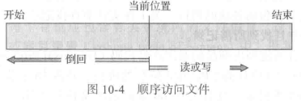
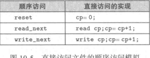
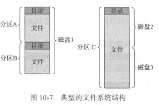

## FileSystem

### File

>   File:对存储设备的物理属性加以抽象 从而定义的逻辑存储单元

文件属性通常包括

-   名称
    -   人类可读形式保存的唯一信息
-   标识符
    -   唯一标识文件系统的文件
    -   非人类可读的名称
-   类型
-   位置
-   尺寸
-   保护
-   时间、日期和用户标识

#### FileOperator

-   创建文件
    -   在文件系统中找到空间
    -   在目录中创建新文件的条目
-   写文件
    -   保留**写指针(write pointer)**
    -   写操作更新指针
-   读文件
    -   保留**读指针(read pointer)**
    -   读操作更新指针
    -   当前操作位置可以作为进程的**当前文件指针(current-file-position pointer)**
-   重新定位文件
    -   将当前文件指针重新定位到给定值(file seek)
-   删除文件
-   截断文件
    -   删除文件内容
    -   保留文件属性

**打开文件表(open-file table)**:用于维护所有打开文件的信息

每个打开文件的关联信息

-   文件指针
    -   对于操作文件的每个进程是唯一的
-   文件打开次数
-   文件的磁盘位置
-   访问权限

>   解决定位文件偏移的常见解决方案是将多个逻辑记录包装到物理块中

#### FileAccess

文件信息访问方式

-   顺序访问
    -   按顺序加以处理
    -   编辑器/编译器常用
    -   
-   直接访问(direct/relative)
    -   文件由固定长度的**逻辑记录(logical records)**组成
    -   数据库常用
    -   
-   其他方法可以建立在直接访问方法上
    -   通常涉及创建文件索引(index)

### DirectoryStructure

>   一个存储设备可以整体使用 也可以划分分区(partition)组成RAID

>   **卷(volume)** 包含文件系统的分区

包含文件系统的每个卷也应包含有关系统内的文件信息

这些信息保存在**设备目录(device directory)**或**卷目录表(volume table of content)**中

设备目录(更常称为目录(directory))记录卷上的所有文件的信息

-   名称
-   位置
-   大小
-   类型
-   ...

Solaris FileSystem

-   tmpfs:"临时"文件系统
    -   它是在易失性内存中创建的
    -   当系统重启或崩溃时 它的内容会被擦除
-   obifs:"虚拟"文件系统
    -   本质上 这是一个内核接口 但看起来像一个文件系统 它让调试器访问内核符号
-   ctfs:维护"合同"信息的虚拟文件系统
    -   以管理哪些进程在系统引导时启动并且在运行时必须继续运行
-   lofs: "环回"文件系统
    -   以允许一个文件系统代替另一个来被访问
-   procfs:虚拟文件系统 
    -   将所有进程信息作为文件系统来呈现
-   ufs, zfs:通用文件系统

#### Directory

>   目录可视为符号表 可将文件名称转为目录条目

这种观点下 可按许多方式组织目录

基本操作

-   搜索文件:
    -   需要能够搜索目录结构
    -   以查找特定文件的条目
        -   由于文件具有符号名称 并且类似名称可以指示文件之间的关系 所以可能需要查找文件名称匹配特定模式的所有文件
-   创建文件:需要创建新的文件，并添加到目录
-   删除文件:当不再需要文件时 希望能够从目录中删除它
-   遍历目录:需要能够遍历目录内的文件 及其目录内每个文件的目录条目的内容
-   重命名文件:由于文件名称可向用户指示内容 因此当文件内容和用途改变时 名称也应改变
    -   重命名文件也允许改变其在目录结构内的位置
-   遍历文件系统:可能希望访问每个目录和目录结构内的每个文件
    -   为了可靠性 定期备份整个文件系统的内容和结构是个好主意
    -   这种备份通常将所有文件复制到磁带上
        -   这种技术提供了备份副本 以防止系统出错
        -   当某个文件不再使用时候 它可被复制到磁带上 它原来占用的磁盘空间可以释放以供其他文件使用

基础的两级目录

-   UFD
-   MFD

多级目录下 每个用户都有自己的**用户文件目录(User File Directory, UFD)**

搜索系统的**主文件目录(Master File Directory, MFD)**

用户名和文件名定义了路径名(path)

用于搜索给定名称的文件所用的目录序列称为**搜索路径(search path)**

>   两级目录-->树状结构-->无环图

>   **链接(link)**实际上是另一文件或子目录的指针
>
>   -   真实文件名包括在连接信息中

在遍历目录时避开链接 既避免环 又没有其他开销

### Mount

-   操作系统需要知道设备的名称和**安装点(mount point)**(附加文件系统在原来文件结构中的位置)

-   有的操作系统要求提供文件系统类型
    -   而其他检查设备结构并确定文件系统的类型

-   通常 安装点是空目录

系统通过语义可以清楚地表达功能

-   系统可能不允许在包含文件的目录上进行安装
-   或者可以使安装的文件系统在该目录处可用 并隐藏目录的原有文件
-   直到文件系统被卸载 进而终止使用文件系统 并且允许访问该目录中的原有文件

### FileSharing

>   共享的调控是访问控制和保护的问题

#### RemoteFS

远程文件系统

-   FTP
-   Distributed File System 分布式文件系统
-   WWW
-   云计算

FTP用于匿名和认证的访问

##### C/S

##### DIS

>   Distributed Information System 分布式信息系统

也称**分布式命令服务(Distributed Naming Service)**

>   **域名系统(Domain Name System, DNS)**:为整个互联网提供主机名到网络地址的转换(host-to-name-to-network address)

分布式信息系统为分布式应用提供了用户名称/密码/用户ID/组ID空间

对于Microsoft的**通用互联网文档系统(Common Internet File System，CIFS)**网络信息与用户认证信息(用户名和密码)一起进行网络登录，以便服务器确定是否允许或拒绝对所请求文件系统的访问。为了使得认证有效，用户名必须在机器之间匹配(如同NFS一样)

>   采用**轻量级目录访问协议( Lightweight Directory Access Protocol, LDAP)**作为安全的分布式命名机制

##### 故障模式

-   文件系统
    -   磁盘故障
    -   目录结构
-   其他磁盘
    -   管理数据(总称元数据**metadata**)的损坏
-   磁盘控制器的故障
-   电缆故障
-   主机适配器故障
-   ...

>   任何单个故障都可以中断DFS命令流

#### ConsistencySemantic

>   一致性语义:用于评估支持文件共享的文件系统的准则

规定系统的多个用户如何访问共享文件

成功实现了复杂共享语义的一个文件系统是**Andrew文件系统(AFS)**

##### UNIX语义

如下语义

-   一个用户对已打开文件的写入 对于打开同一文件的其他用户立即可见
-   一种共享模式允许用户共享文件的当前位置指针
    -   一个用户前移指针就会影响所有共享用户
    -   这里 一个文件具有单个镜像(single physics image) 允许来自不同用户的交替访问

##### 会话语义

Open AFS

-   一个用户对已打开文件的写入 对于打开同一文件的其他用户 不是立即可见
-   一旦文件关闭 对其所做的更改只能被后来打开的会话可见
    -   已打开的文件实例并不反映这些变化

##### 不可变共享语义

>   **Immutable shared file**

一旦一个文件由创建者声明为共享 就不能被改变

实现较为简单

##### Comparison

|          | physics image                                       | 调度影响                           |
| -------- | --------------------------------------------------- | ---------------------------------- |
| UNIX     | 一个文件与单个物理镜像相关联 可作为独占资源访问 | 争取这种单个镜像导致用户进程的延迟 |
| Open AFS | 一个文件在同一时间可以临时关联多个(可能不同的)镜像  | 调度访问几乎没有强制约束           |

