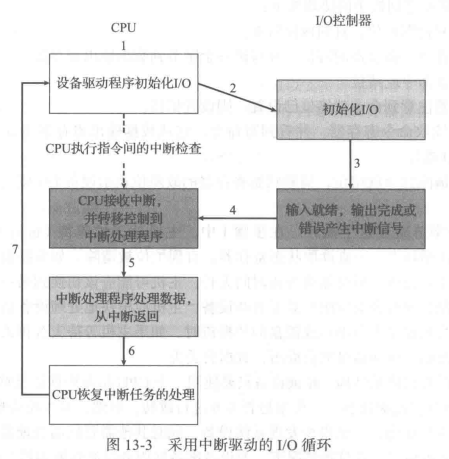
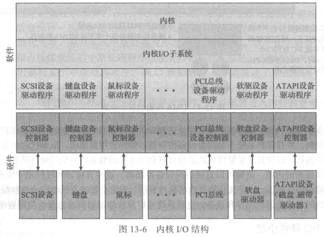
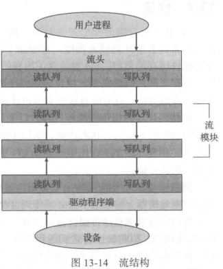

## IO

### Overview

Device Driver提供了统一的设备访问接口

I/O端口通常由四个寄存器组成

1.  数据输入(data-in):被主机读出以获取数据
2.  数据输出(data-out):被主机写入以发送数据
3.  状态寄存器(status):包含一些主机可以读取的位
    1.  当前命令是否完成
    2.  数据输人寄存器中是否有数据可以读取
    3.  是否出现设备故障等
4.  控制寄存器(control):可由主机写入 以便启动命令或更改设备模式
    1.  串口控制寄存器中的一位选择全工通信或单工通信
    2.  另一位控制启动奇偶校验检查

### Interact

1.  轮询(poll)
    1.  命令寄存器的命令就绪位(command-ready bit)
2.  中断(interrupt)
    1.  中断请求线(Interrupt-Request Line)

#### DMA

直接内存访问 不占用程序控制IO

内存 <- 外设

DMA-request

DMA-acknowledge

### App IO Interface

| 方面         | 差异                            | 例子                 |
| ------------ | ------------------------------- | -------------------- |
| 数据传输模式 | 字符 块                         | 终端 磁盘            |
| 访向方式     | 顺序 随机                       | 调制解调器 光盘      |
| 传输方式     | 同步 异步                       | 磁带 键盘            |
| 分享         | 专用 共享                       | 磁带 键盘            |
| 设备速度     | 延迟 寻道时间 传输速率 操作延迟 |                      |
| I/O方向      | 只读 只写 读写                  | 光盘 图形控制器 磁盘 |

-   字符流或块:字符流设备逐个字节来传输 而块设备以字节块为单位来传输
-   顺序访问或随机访问:顺序访问设备按设备确定的固定顺序来传输数据 而随机访问设备的用户可以指示设备寻找到数据存储的任意位置
-   同步或异步:
    -   同步设备按预计的响应时间来执行数据传输 并与系统的其他方面相协调
    -   异步设备呈现不规则或不可预测的响应时间 并不与其他计算机事件相协调
-   共享或专用:共享设备可以被多个进程或线程并发使用 而专用设备则不能
-   操作速度:设备的速度范围从每秒数字节到每秒数G字节
-   读写、只读、只写:有的设备能执行输人也能执行输出 而其他的只支持单向数据传输

>   `ioctl` 能使应用程序访问设备驱动程序实现任何功能

#### Block-device

-   原始I/O(raw I/O):将块设备作为简单的线性块数组访问
-   直接I/O(direct I/O):禁止缓冲和锁定的文件操作

| 设备     | 块设备     | 字符设备 |
| -------- | ---------- | -------- |
| 访问方式 | read/write | get/put  |

键盘通过字符流就扣访问

#### Net-device

接口为 socket

#### Timer

-   获取当前时间
-   获取经过时间
-   设置定时器 以便在T时触发操作X

#### vector I/O

允许系统调用 来执行多个位置的多个I/O操作

### stream

>   流是在设备驱动程序和用户级进程之间的全双工连接

它包括与用户进程相连的流头(stream head) 控制设备的驱动程序端(driver end) 位于两者之间的若干个流模块(stream module)

