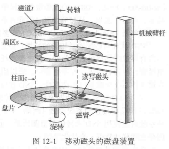
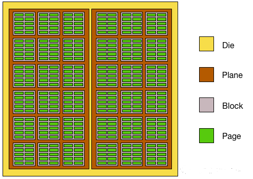
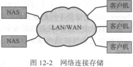
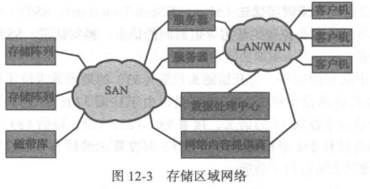
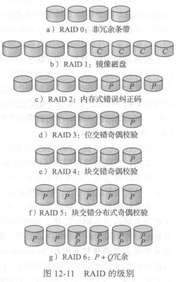
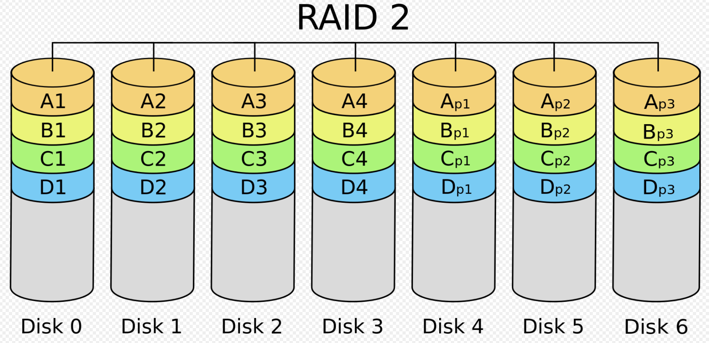
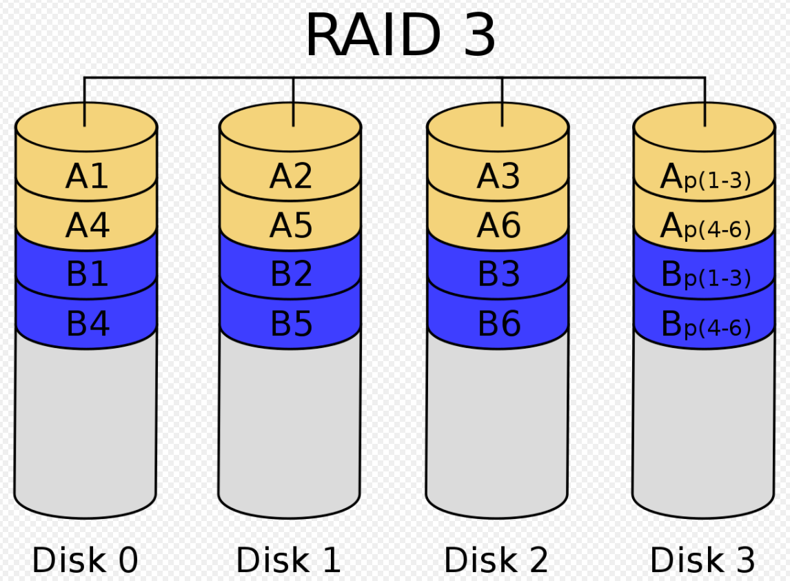
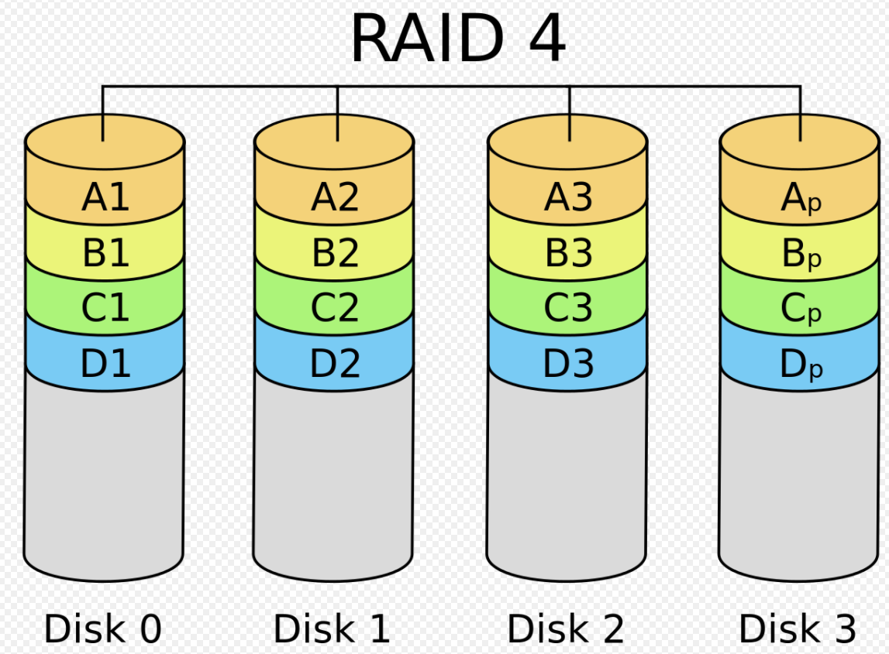
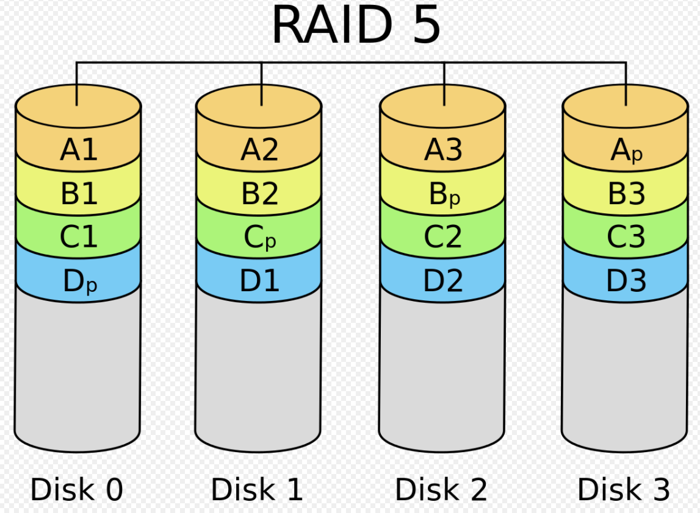
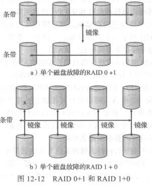

## Storage

### overview

>   二级三级存储设备的结构

#### disk

磁盘或硬盘(magnetic/hard disk)为现代计算机系统提供了大量外存

P388

#### Solid-State Disk

>   更省电 吞吐量和格式化同样使用

存储颗粒:NAND 散存

多层堆叠

每个存储单位的状态数来区分

-   SLC:single bit 0/1
-   MLC:two bits
-   TLC:three bits

##### FTL

>   Flash Translation Layer 散存转换层

将本来的一层物理地址 转换成 逻辑Block和物理Block

##### Wear Levelling

>   磨损均衡/寿命均衡

##### GC

>   垃圾回收

1.  标记不需要块
2.  等到垃圾比较集中时
    1.  复制需要
    2.  集中清理
3.  产生新块

#### Magnetic tape

### structure

>   现代磁盘驱动器可以看作逻辑块的一维数组
>
>   逻辑块为最小传输单位

一维数组依次映射到磁盘扇区

### disk attach

计算机访问磁盘存储

-   I/O port
    -   主机连接存储
    -   [host-attached storage](#Host-attached)
    -   小系统常用
-   分布式文件系统的远程主机
    -   网络连接存储
    -   [Network-attached storage](#Network-attached)

##### Host-attached

通过本地I/O端口访问

-   台式机:
    -   IO总线
    -   IDE
    -   ATA
    -   SATA
-   工作站和服务器
    -   更复杂的I/O
    -   FC(Fibre Channel)

FC变体

-   更大的交换结构:24位地址
    -   存储域网([Storage-Area Network, SAN](#Storage-Area-Network))
-   FC仲裁环路(FC Arbitrated Loop)
    -   可以寻址126个设备

##### Network-attached

>   专用存储系统 可以通过数据网络来远程访问

Internet 小型计算机系统接口(Internet Small Computer System Interface, iSCSI)是最新的网络连接存储协议

##### Storage-Area Network

网络连接存储系统的缺点 存储I/O操作消耗数据网络带宽 增加网络通信延迟

专用网络

采用存储协议而非网络协议

### 磁盘调度

访问时间:

-   寻道时间(seek time):磁臂移动磁头到包含目标扇区的柱面的时间
-   旋转延迟(rotational latency):磁盘旋转目标扇区到磁头下的额外时间

**磁盘带宽(disk bandwidth)**是传输字节的总数除以从服务请求开始到最后传递结束时的总时间

通过管理磁盘I/O请求的处理次序 可以改善访问时间和带宽

#### FCFS

#### SSTF

>   最短寻道时间优先(**Shortest-Seek-Time-First, SSTF**)

本质上是最短作业优先(SJF)调度

并不一定最优

#### SCAN

扫描算法

电梯算法

>   当到达磁盘的另一端时 磁头移动方向反转 并继续处理
>
>   磁头连续来回扫描磁盘

#### C-SCAN

循环扫描

立刻回到开头 不扫描回程

#### LOOK

不移动到一端 只到一个方向最远请求的SCAN算法

### Management

#### Formatting

##### Physical Format

一个新的磁盘是一个空白盘:它只是一个磁性记录材料的盘子

低级格式化(**low-level formatting**)或物理格式化(**physical formatting**)

>   在磁盘可以存储数据之前 它必须分成扇区 以便磁盘控制器能够读写

头部和尾部包含一些磁盘控制器的使用信息

##### Logical Format

操作系统将初始的文件系统数据结构存储到磁盘上

### Swap

>   交换空间管理(swap-space management)是操作系统的另一底层任务

虚拟内存采用磁盘空间作为内存的拓展 减缓空间用来给虚拟内存提供最佳吞吐量

推荐高估

可创建在

1.  普通文件系统上
2.  单独的磁盘分区
3.  原始分区 -- 针对速度优化

### RAID

多种磁盘组织技术统称为**磁盘冗余阵列**(Redundant Arrays of Independent Disk, RAID) 用于处理性能和可靠性问题

#### Redundancy

存储额外信息

>   **镜像(Mirror)** 重复每个磁盘 最简单的冗余方法

解决不一致问题

1.  先写一个副本 再写下一个
2.  为RAID添加固态非易失性RAM(**Nonvolatile RAM**)的缓存

#### Parallel

通过镜像 读取速度加倍

采用多个磁盘 数据分散储存 也可以改善传输率

##### Striping

>   分条

位级分条(bit-level striping):将每个字节分散在多个磁盘

>   如果有8个磁盘 则可以将每个字节的位i写到磁盘i上

块级分条(block-level striping):文件的块分散在多个磁盘上

对于 $n$ 个磁盘 文件的块 $i$ 可存在磁盘($i\;{\rm{mod}}\; n$)+1上

磁盘系统的并行化 通过分条实现有两个主要目标:

-   通过负载平衡 增加了多个小访问(即页面访问)的吞吐量

-   降低大访问的响应时间

#### RAID Level

P -- 纠错位

C -- 第二副本

##### RAID0

1.  块分条
2.  无冗余

##### RAID1

Mirror

##### RAID2

>   内存方式的差错纠正组织

实现了基于奇偶位的错误检测

ECC方法通过将字节分散在磁盘上 可以直接用于磁盘阵列

Hamming Code

##### RAID3

>   位交错奇偶检验结构

比特分割

##### RAID4

>   块交错奇偶校验结构采用块级分条

将奇偶校验单独存储在一个 P 盘上

##### RAID5

>   块交错分布奇偶校验结构

将数据和奇偶校验分散存在所有磁盘上

##### RAID6

>   P+Q冗余方案(P+ Q redundancy scheme)

使用了奇偶校验+差错纠正码(如Read-Solomon Code)

##### RAID0+1/1+0

复合方案 通常比RAID5性能更好

#### 特征

| 快照                         | 复制                   | 热备份                   |
| ---------------------------- | ---------------------- | ------------------------ |
| snapshot                     | replication            | hot spare                |
| 最后一次更新前文件系统的视图 | 不同站点间自动复制写入 | 配置成磁盘故障时用作替换 |

