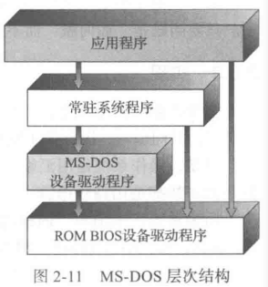
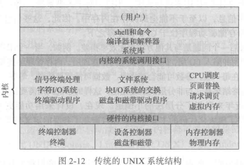
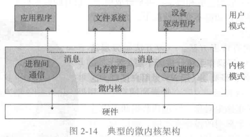
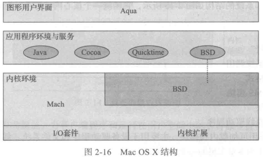
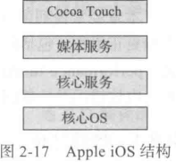
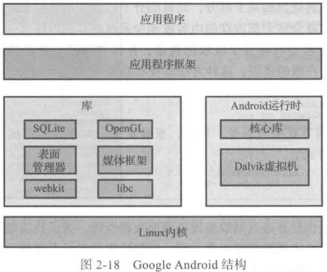

## kernel

### 系统结构

#### 混合系统

##### MacOS

1.  Mach 微内核
    1.  内存管理
    2.  远程过程调用 RPC
    3.  进程间通信 IPC
    4.  线程调度
2.  BSD Unix内核
    1.  CLI
    2.  Net/FileSystem
    3.  POSIX API
3.  I/O Kit
    1.  kernel extension

##### IOS

>   Cocoa 规定用于 Objective-C 的 API

##### Android

