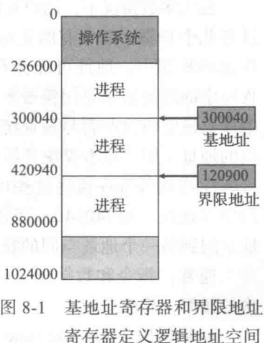
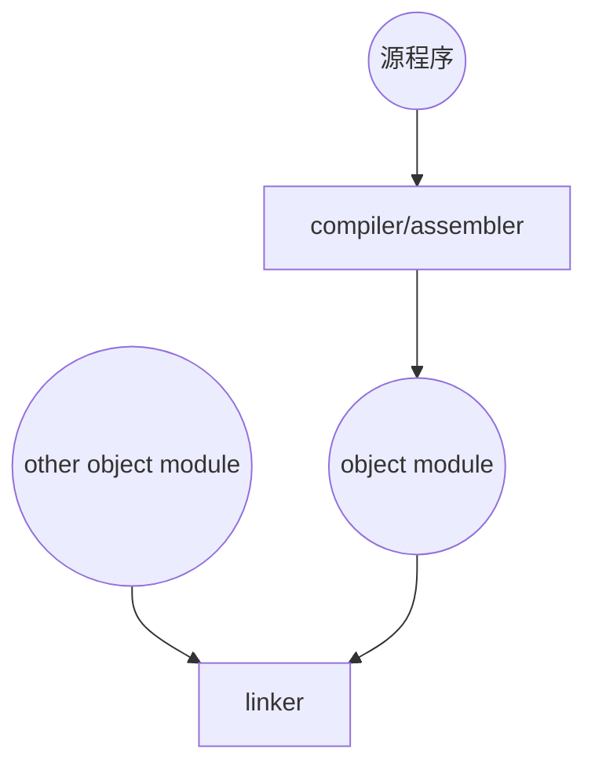
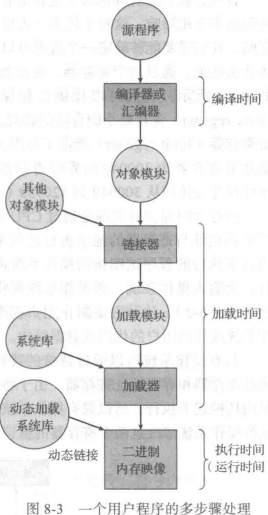
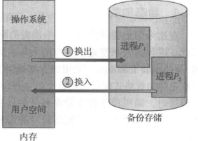
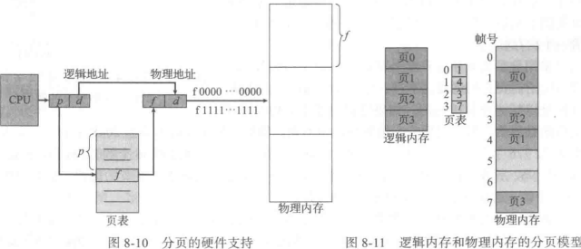
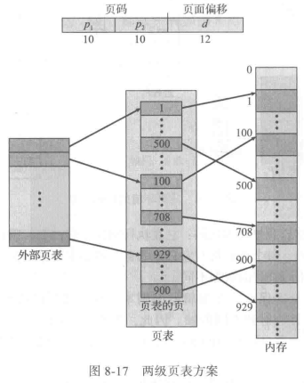

## memory

>   MMU CPU内存管理单元

### basic

CPU可以直接访问的通用存储只有内存和处理器内置的寄存器

确保进程内存空间独占 : 通过两个寄存器

-   基地址寄存器(base register) : 最小的合法的物理内存地址
-   界限地址寄存器(limit register) : 范围的大小



>   只有操作系统可以通过特殊的特权指令(只能在内核模式下执行) 才能加载基地址寄存器和界限地址寄存器

#### 地址绑定





>   **input queue** 输入队列
>
>   在磁盘上等待调到内存以便执行的进程

源程序中的地址通常是用符号表示

编译器通常将这些符号地址**绑定**到可重定位的地址


-   compile time

    -   如果在编译时就已知道进程将在内存中的驻留地址 那么就可以生成**绝对代码**
    -   如果事先就知道用户进程驻留在内存地址R处 那么生成的编译代码就可以从该位置开始并向后延伸

-   load time

    -   加载时(loadtime):如果在编译时并不知道进程将驻留在何处 那么编译器就应生成**可重定位代码(relocatable code)**
        -   最后绑定会延迟到加载时才进行
    -   如果开始地址发生变化 那么只需重新加载用户代码以合并更改的值

-   runtime time

    -   如果进程在执行时可以从一个内存段移到另一个内存段 那么绑定应延迟到执行时才进行

    | 逻辑/虚拟地址 | CPU生成的地址                        |
    | ------------- | ------------------------------------ |
    | 物理地址      | 内存单元看到的地址                   |
    | 逻辑地址空间  | 程序所生成的所有逻辑地址的集合       |
    | 物理地址空间  | 这些逻辑地址对应的所有物理地址的集合 |


>   这里 基地址寄存器 被称为 重定位寄存器(**relocation register**)

#### 动态加载

-   为了获得更好的内存空间利用率
-   调用时才加载

动态链接库(dynamically linked library)

静态链接(static linking)

>   如果有动态链接 在二进制映像内 每个库程序的引用都有一个**存根(stub)**
>
>   -   一小段代码
>   -   指出如何定位适当的内存驻留库程序

### swap

>   进程必须在内存中以便执行

进程可以暂时从内存交换(**swap**)到备份存储(**backing store**)



>   系统维护一个可运行的所有进程的**就绪队列(ready queue)** 它们的映像在备份存储或内存中

交换时间主要部分是传输时间

解决确保换出进程是完全处于空闲状态的问题

-   不能换出等待处理I/O的进程
-   I/O操作的执行只能使用操作系统的缓冲

>   只有在进程换入时 操作系统缓冲与进程内存之间才能进行数据转移

双缓冲(**double buffering**)

### 连续内存分配

内存两区

-   驻留操作系统
-   用于用户进程

#### 内存分配

>   可以作为一大块的可用内存 被称为孔(**hole**)

| 分配方式                     | 描述                                                |
| ---------------------------- | --------------------------------------------------- |
| 固定分区(partition)          | 最简单 一个分区一个进程                             |
| 可变分区(variable-partition) | 操作系统有一个表 用于记录哪些内存可用和哪些内存已用 |
| 通用动态分配                 | 根据一组空闲孔来分配大小为n的请求                   |

| 常用方法 | 方法                                                         | 效果                                                         |
| -------- | ------------------------------------------------------------ | ------------------------------------------------------------ |
| 首次适应 | 分配首个足够大的孔 查找可以从头开始 也可以从上次首次适应结束时开始 <br/>一旦找到足够大的空闲孔 就可以停止 | 可能最好                                                     |
| 最优适应 | 分配最小的足够大的孔 应查找整个列表 除非列表按大小排序       | 可以产生最小剩余孔                                           |
| 最差适应 | 分配最大的孔 同样应查找整个列表 除非列表按大小排序           | 可以产生最大剩余孔 该孔可能比最优适应产生的较小剩余孔更为适用 |

>   用于内存分配的首次适应和最优适应算法都有外部碎片(**external fragmentation**)的问题

>   50%规则(**50-percent rule**) $N$个可分配块 可能有$0.5N$个块为外部碎片(首次适应的统计说明)

按固定大小的块为单位来维护 进程所分配的内存可能比所需的要大 差值称为**内部碎片(internal fragmentation)**

外部碎片问题的一种解决方法是**紧缩**(compaction)

另一个可能的解决方案:允许进程的逻辑地址空间不连续(使用[分段](#segmentation)和[分页](#paging))

#### segmentation

>   允许进程的物理地址空间非连续

逻辑地址空间是由一组段构成

每个段有名称和长度

段的逻辑地址由有序对(two tuple)组成`< seg,off >`

>   段表(**segment table**)实现映射用户定义的二维地址到一维地址

段表的每个条目

-   段基地址 : 包含该段在内存中的开始物理地址
-   段界限 : 该段的长度


#### paging

类似于分段的内存管理方案

-   将物理内存分为固定大小的块 **帧/页帧(frame)**
-   将逻辑内存分为同样大小的块 **页/页面(page)**



CPU生成的地址:页码和页偏移

>   获取Linux系统页大小
>
>   ```C
>   getpagesize()
>   ```
>
>   ```bash
>   $ getconf PAGESIZE
>   4096
>   ```

内存分配以**帧**为单位 分页方案不会产生外部碎片

如果进程大小与页大小无关 那么每个进程的内部碎片的均值为半页

>   当系统进程需要执行时 它将检查进程的大小(按页计算)每页都需要一帧

**分页**:将编程内存和实际的物理内存分离

**帧表(frame table)**:存储物理内存的分配细节

#### about hardware

**页表硬件**实现有多种方法

>   CPU 进行地址转换

最简单的:将页表作为一组专用的**寄存器**来实现

在大页表的环境下 将页表放在内存中 并将**页表基地址寄存器(Page-Table Base Register)**指向页表

页表长度指针(Page-Table length Register, PTLR)

-   使用**转换表缓冲区(Translation Look-aside Buffer,TLB)**

#### shared page

>   分页的优点之一是**可以共享公共代码**

>   可共享:**可重入代码(reentrant code)**或**纯代码(pure code)**

### 页表结构

最常用技术

-   分层分页
-   哈希页表
-   倒置页表


#### 分层分页

多层分页 \[page0\]\[page1\]\[offset\]

一层页表 10 bits



>向前映射页表

现在使用四级页表


#### 哈希页表

>   Hashed page table

处理大于32位地址空间常用办法

采用虚拟页码作为哈希值

每个条目包含一个链表

-   虚拟页码
-   映射的帧码
-   指向链表内下一个元素的指针

>   一个变体:**聚簇页表**-- clustered page table

#### 倒置页表

### QA

虚拟化的实现