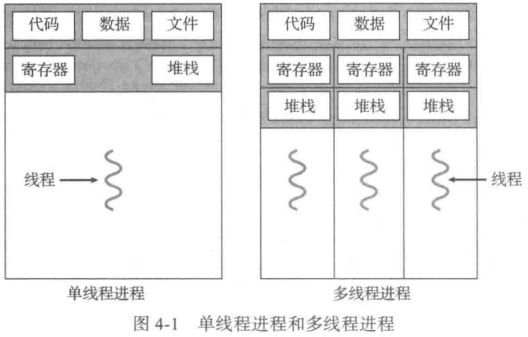
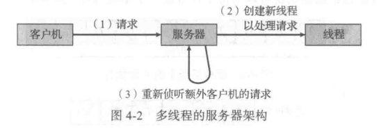
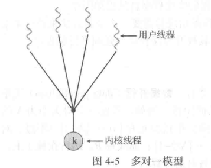
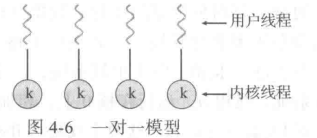
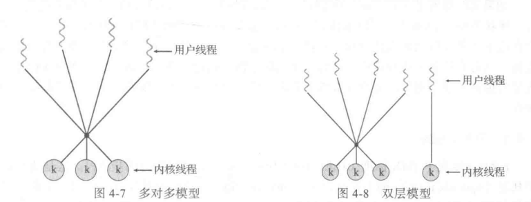
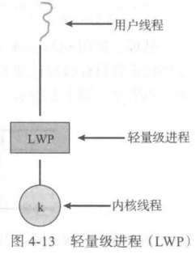
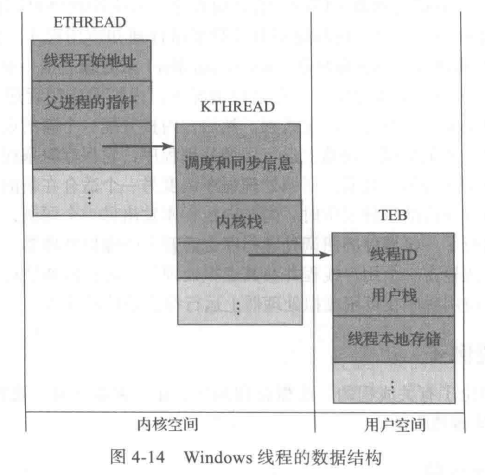

## MultiThread






优点

-   响应性
-   资源共享
    -   允许一个应用在同一地址空间内有多个不同活动进程
-   经济
-   可伸缩性

>   multicore multiprocessor

| **parallelism** | 并行性 | 同时执行多个任务                      |
| --------------- | ------ | ------------------------------------- |
| **concurrency** | 并发性 | 支持多个任务 允许所有任务都能取得进展 |

>   **Amdahl** 定理
>
>   如果 S 是应用程序的一部分 具有 N 个处理核的系统上可以串行执行


$$
\text{加速比} \le \frac{1}{S+\frac{1-S}{N}}
$$

>   根本原则 : 对于通过增加额外计算核而获得的性能 应用程序的串行部分可能具有不成比例的效果

多线程挑战

-   识别任务 : 分析程序 分为任务
-   平衡 : 识别可并行时 确保任务工作价值
-   数据分割 : 正如应用程序要分为单独任务，由任务访问和操作的数据也应划分以便运行在单独的核上
-   数据依赖 : 任务访问的数据必须分析多个任务之间的依赖关系
-   测试与调试 : 多核时的执行路径

并行类型

| 数据并行 | 将数据分布于多个计算核       |
| -------- | ---------------------------- |
| 任务并行 | 将任务(线程)分配到多个计算核 |

### multithread model

-   user thread
-   kernel thread

用户线程位于内核上

内核线程由操作系统来直接支持与管理

#### 多对一模型



>   映射多个用户级到一个内核线程
>
>   线程管理是由用户空间的线程库来完成的

#### 一对一模型

>   映射每个用户到一个内核进程
>
>   允许多线程并行在多处理器系统上

缺陷 : 创建一个用户进程就要创建一个相应的内核进程



#### 多对多模型

>   多路复用多个用户线程到同样数量或更少数量的内核线程



>   **双层模型** : 在多对多的基础上 允许用户程序和内核程序的绑定

### thread library

>   提供创建和管理线程的 API

-   提供一个没有内核支持的库
    -   代码和数据结构都在用户空间
    -   函数只是用户本地函数调用
-   操作系统直接支持的内核级的库
    -   代码和数据结构都在内核空间
    -   API 函数是对内核的系统调用


三种主要线程库

-   [POSIX Pthreads](#Pthreads)
    -   用户级
    -   内核级
-   Windows
    -   Windows 内核级
-   Java
    -   Java 程序中创建和管理
    -   基于 JVM
    -   利用宿主环境

>   对于POSIX和Windows线程 全局声明(即在函数之外声明的)的任何数据 可为同一进程的所有线程共享
>
>   Java没有全局数据的概念 所以线程对共享数据的访问必须加以显式安排

属于某个函数的本地数据通常位于堆栈 由于每个线程都有自己的堆栈 每个线程都有自己的本地数据

#### Pthreads

>   **POSIX(IEEE 1003.1c)** API specification

线程创建`<pthread.h>`

-   `pthread_attr_init`
-   `pthread_create`
    -   thread_id
    -   thread_attr_id
    -   func
    -   params
-   `pthread_join`

#### Windows Thread

`<windows.h>`

-   `CreateThread`
-   `WaitForSingleObject`
    -   数量
    -   指针
    -   标志
    -   时长

#### Java Thread

```java
public interface Runnable{
    public abstract void run();
}
```

### implicit multi-thread

JVM 的具体线程模型依赖于宿主操作系统

#### thread pool

>   在进程开始时创建一定数量的线程 并加到池中以等待工作
>
>   当服务器收到请求时 它会唤醒池内的一个线程(如果有可用线程) 并将需要服务的请求传递给它
>
>   一旦线程完成了服务 它会返回到池中再等待工作
>
>   如果池内没有可用线程 那么服务器会等待 直到有空线程为止

Windows API 有线程池有关的多个函数

#### [OpenMP](https://www.openmp.org/)

>   一组编译指令和API [self-reference](https://gitee.com/HughNew/note/blob/master/OpenMP/OpenMP.md)

#### GCD

>   大中央调度(Grand Central Dispatch)

增加 **块Block** 拓展

`^{printf("I am a block");}`

将块放置在**调度队列**上

>   内部由**POSIX**线程组成

### thread problem

#### [fork/exec](./process.md#UnixAPI)

#### signal

default|user-defined signal handler

-   信号是由特定事件的发生而产生的
-   信号被传递给某个进程
-   信号一旦收到就应处理

信号传递选择

-   传递信号到信号所适用的线程

-   传递信号到进程内的每个线程

-   传递信号到进程内的某些线程

-   规定一个特定线程以接收进程的所有信号

`kill(pid_t pid,int signa;)`

`pthread_kill(pthread_t tid,int signal)`

Windows 不显式提供信号支持 允许通过 **异步过程调用(Asynchronous Procedure Call, APC)** APC(给特定线程)与UNIX一部信号大致相同

#### thread cancellation

-   异步撤销
    -   立即终止
-   延迟撤销
    -   检查是否应终止
    -   允许线程有序终止自己

**Pthreads**线程通过API设置状态

| 模式 | 状态          | 类型 |
| ---- | ------------- | ---- |
| 关闭 | 禁用          | -    |
| 延迟 | 启用(default) | 延迟 |
| 异步 | 启用          | 异步 |

延迟撤销 : 线程到达撤销点 才会撤销

`pthread_testcancel` 建立撤销点

#### TLS

>   Thread-Local Storage 线程本地存储

线程自己的数据

类似于static

#### scheduler activate

许多系统在实现多对多或双层模型时 在用户和内核线程之间增加一个中间数据结构 这个数据结构通常称为轻量级进程(**LightWeight Process,LWP**)



### OS examples

#### Windows

线程组件

-   tid
-   registers group
-   user stack
-   private storage(for dlls and runtimes)

后三者被称为线程上下文

| 数据结构 | 内容                                                         |            |
| -------- | ------------------------------------------------------------ | ---------- |
| ETHREAD  | 线程所属进程的指针 线程控制开始的程序的地址及对应 KTHREAD的指针等 | 执行线程块 |
| KTHREAD  | 线程调度信息 内核堆栈和TEB指针                               | 内核线程块 |
| TEB      |                                                              | 线程环境块 |



#### Linux

>   Linux 使用任务(task) 而非线程进程

fork 进程复制

clone 线程创建需要传递标志 确定父子任务间的分享

| 标志          | 含义             |
| ------------- | ---------------- |
| CLONE_FS      | 共享文件系统信息 |
| CLONE_VM      | 共享相同内存空间 |
| CLONE_SIGHAND | 共享信号处理程序 |
| CLONE_FILES   | 共享一组打开文件 |

**clone** 没有设置标志时 类似于 **fork** 的功能

