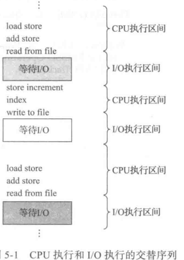
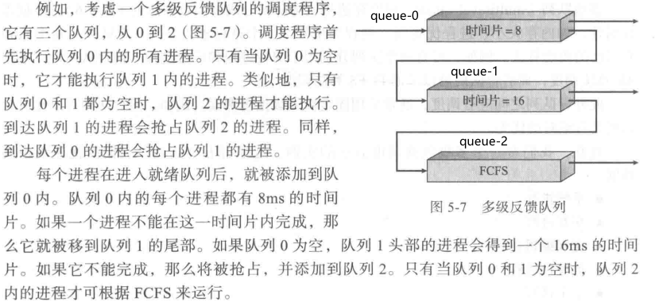
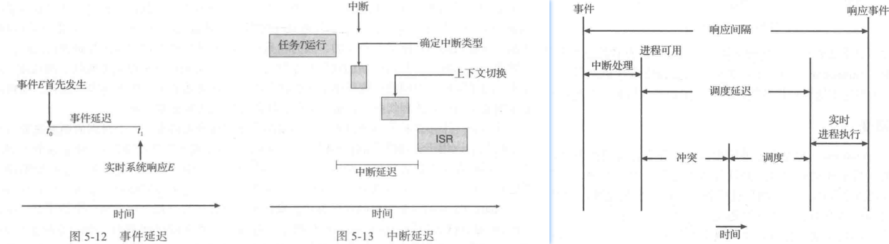
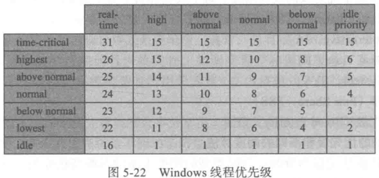

## process-schedule

术语进程调度(process scheduling)或线程调度(thread scheduling)常常交替使用

讨论一般调度概念时 采用进程调度

针对线程特定概念时 采用线程调度

CPU调度成功取决于进程执行

-   CPU执行
-   I/O等待



就绪队列内的记录通常为进程控制块(**Process Control Block,PCB**)


需要CPU调度的情况

1.  runtime -> wait (I/O request/wait)
2.  runtime -> ready(发生中断)
3.  wait -> ready(I/O 完成)
4.  end

只发生 1 4 调度的方案为 **非抢占的(nonpreemptive)** 或 **协作的(cooperative)**

否则称为 **抢占的(preemptive)**


调度程序(dispatcher)

-   切换上下文
-   切换到用户模式
-   跳转到用户程序的合适位置，以便重新启动程序

>   调度准则
>
>   -   CPU 使用量
>       -   Range(40,90)
>   -   吞吐量(throughput)
>       -   每小时完成进程数量
>   -   周转时间(turnaround time)
>       -   从进程提交到进程完成的时间段
>       -   等待进入内存
>       -   就绪队列等待
>       -   CPU执行
>       -   I/O执行
>   -   等待时间
>       -   CPU 调度算法只影响进程在就绪队列中的等待时间
>   -   响应时间
>       -   从提交请求到第一响应的时间

### process schedule

#### FCFS

>   First-Come First-Served
>
>   最简单的调度算法

通过FIFO队列实现 非抢占式的

#### SJF

>   Shortest-Job-First
>
>   最短作业优先 最优
>
>   但无法在短期CPU调度实现

**最短下次CPU执行(shortest-next-CPU-burst)**

调度取决于下次CPU执行长度

>   真正的困难在于知道下次CPU执行的长度

##### CPU执行预测

以前CPU执行的测量长度的指数平均(**exponential average**)

$$
\tau_{n+1}\;=\;at_n\,+\,(1-a)\tau_n
$$
$t_n$ 第n个CPU执行长度

$\tau_n$ 过去历史

$\tau_{n+1}$ 下次CPU执行预测值

$a$ 控制最近和过去历史在预测中的权重

可以是抢占的 也可以是非抢占的

##### shortest-remaining-time-first

>   抢占SJF调度

#### priority-schedule

>   通用优先级调度

SJF是一个特例

具有相同优先级的进程按FCFS顺序调度

一个问题

-   无穷阻塞 infinite blocking
    -   就绪运行但是等待CPU的进程可以认为是阻塞的
-   饥饿 starvation

解决方案之一

-   老化 aging
    -   逐渐增加在系统中等待很长时间的进程的优先级

#### Round-Robin

>   转轮调度(Round-Robin,RR) 专为分时系统设计
>
>   FCFS+抢占

将一个较小时间单元定义为**时间量(time quantum)**或**时间片(time slice)** 通常为 10-100ms

CPU调度程序循环整个就绪队列 为每个进程分配不超过一个时间片的CPU

RR算法的性能很大程度取决于时间片大小

>   根据经验 80%的CPU执行应该小于时间片

#### multilevel queue

>   多级队列 : 将就绪队列分成多个单独队列

进程

-   前台进程(foreground process)(交互进程)
-   后台进程(background process)(批处理进程)

多种处理方式

-   队列间的绝对优先级
-   比例划分CPU时间 分别调度

#### multilevel feedback queue

>   多级队列调度+进程队列间迁移

根据不同CPU执行的特点来区分进程

如果CPU使用过多 则转移到更低的优先级队列

-   将I/O密集型和交互进程放在更高优先级队列上
-   在较低优先级队列中等待过长的进程会被移到更高优先级队列



多级反馈队列调度程序可由下列参数来定义

-   队列数量
-   每个队列的调度算法
-   用以确定何时**升**级到更高优先级队列的方法
-   用以确定何时**降**级到更低优先级队列的方法
-   用以确定进程在需要服务时将会进入哪个队列的方法

>   最通用CPU调度算法 同时最复杂

### thread schedule

竞争范围

| 名称                                           | 范围     | 形式                     |
| ---------------------------------------------- | -------- | ------------------------ |
| 进程竞争范围(**Process-Contention Scope,PCS**) | 同一进程 | 系统线程库调度用户级线程 |
| 系统竞争范围(**System-Contention Scope,SCS**)  | 同一CPU  | 内核级线程竞争CPU        |

PCS通常采用优先级调度

#### Pthreads 调度

```C
// 指定竞争范围
PTHREAD_SCOPE_PROCESS; // 按PCS来调度线程
PTHREAD_SCOPE_SYSTEM; // 按SCS来调度线程

// 获取和设置竞争范围
pthread_attr_setscope(pthread_attr_t *attr,int  scope);
pthread_attr_getscope(pthread_attr_t *attr,int *scope); // 发生错误则返回非0
/**
 * scope :: PTHREAD_SCOPE_SYSTEM|PTHREAD_SCOPE_PROCESS
 */
```

### 多处理器

>   没有最好方案

-   非对称多处理
    -   (asymmetric multiprocessing)
    -   一个处理器处理所有调度 I/O及其他系统活动
    -   其他处理器只执行用户代码
-   对称多处理(**Symmetric MultiProcessing,SMP**)
    -   每个处理器自我调度

>   处理器亲和性(**process affinity**) : 大多数SMP系统试图避免进程转移处理器

-   软亲和性
    -   试图保持进程运行在同一处理器
-   硬亲和性
    -   提供系统调用支持(Linux : `sched_setaffinity`)

#### load balance

-   push migration
-   pull migration

负载平衡往往会抵消处理器亲和性的好处


处理器核的多线程

| 粗粒度(coarse-grained) | 线程切换前 刷新指令流水线 成本高                            |
| ---------------------- | ----------------------------------------------------------- |
| 细粒度(fine-grained)   | 在更细的粒度级别上(通常在指令周期的边界上)切换线程 成本很小 |

### CPU real-time schedule

-   soft real-time system : 不保证会调度关键实时进程 只保证这类进程会优先于非关键进程
-   hard real-time system : 一个任务应在它截止期限之前完成

#### 最小化延迟



>   事件延迟(event latency) 从事件发生到时间得到服务的这段时间

两种类型的延迟影响实时系统的性能

-   中断延迟(interrupt latency)
-   调度延迟(dispatch latency)

##### interrupt

>   从CPU收到中断到中断处理程序开始的时间

>   ISR : Interrupt Service Routine 中断服务程序

尽量减少中断延迟 以确保实时任务得到立即处理


##### dispatch

>   调度程序从停止一个进程到启动另一个进程所需的时间量

>   保持调度延迟尽可能低的最有效技术是 **提供抢占式内核**

冲突阶段

-   抢占内核进程
-   释放资源

#### 优先级调度

准入控制算法

-   承认进程 保证进程完成
-   不能保证任务能在截止期限前得以服务 拒绝请求

#### 单调速率调度

>   rate-monotonic
>
>   调度周期性任务
>
>   -   抢占
>   -   静态优先级


P178-180

### OS-examples

#### Linux

timeline

-   before V2.5 : 传统Unix调度
-   V2.5 : 增加对SMP支持
    -   处理器亲和性
    -   负载平衡
-   V2.6.23 : 完全公平调度程序
    -   Completely Fair Scheduler CFS

##### CFS

CFS 是 Linux默认调度算法

>   Linux系统的调度基于调度类(scheduling class)  每个类都有一个特定优先级

针对不同调度类 采用不同调度算法

-   不严格按优先级分配时间片
-   为每个任务分配一定比例的CPU处理时间
-   分配比例根据**友好度(nice value:-20-19)**
    -   默认为0
    -   低友好值--高优先级
-   采用目标延迟(**target latency**)
-   没有直接分配优先级
-   通过任务变量`vruntime` 维护虚拟运行时间
    -   虚拟运行时间与基于任务优先级的衰减因子有关
    -   更低优先级的任务比更高优先级的任务具有更高衰减速率


#### Windows

>   基于优先级 抢占调度
>
>   确保具有最高优先级的线程总是在运行的

32级优先级方案

优先级分类 : 

-   可变类(variable class) 1-15
-   实时类(real-time class) 16-31
-   内存管理 0

如果没有找到就绪线程 调度程序执行空闲线程(**idle thread**) 一个特别线程

具有给定优先级类的-个线程也有一个相对优先级。这个相对优先级的值包括:

-   IDLE
-   LOWEST
-   BELOW_NORMAL
-   NORMAL
-   ABOVE_NORMAL
-   HIGHEST
-   TIME_CRITICAL


每个线程在所属类型中有一个优先级基值

默认地 优先级基值为一个类型的优先级相对值 NORMAL 每个优先级类型的优先级基值为

-   REALTIME_PRIORITY_CLASS--24

- HIGH_PRIORITY_CLASS--13
- ABOVE_NORMAL_PRIORITY_CLASS--10
- NORMAL_PRIORITY_CLASS--8
- BELOW_NORMAL_PRIORITY_CLASS--6
- IDLE_PRIORITY_CLASS--4



>   Windows7 引入**用户模式调度**(User-Mode Scheduling, UMS) 允许应用程序在内核外创建和管理线程

#### Solaris

基于优先级的线程调度 进程类型

-   分时(Time Sharing)
-   交互(Interactive)
-   实时(Real Time)
-   系统(System)
-   公平分享(Fair Share)
-   固定优先级(Fixed Priority)


### 算法评估

确定评估标准/选择准则

#### 确实性模型

一种主要类别的评估方法:分析评估法(analytic evaluation)

>   确定性模型(deterministic modeling) 为一种分析评估类型

采用特定的预先确定的负荷 计算在给定负荷下每个算法的性能

#### 排队模型

计算机系统可描述成服务器网络

-   每个服务器都有一个等待进程队列
-   CPU是具有就绪队列的服务器 IO系统是具有设备队列的服务器


>   **排队网络分析(queueing- network analysis)** 已知到达率和服务率 可以计算使用率 平均队列长度 平均等待时间等

$$
n\,=\lambda\,\times\,W \;\;\text{Little 公式}
$$

| $n$       | 平均队列长度     |
| --------- | ---------------- |
| $\lambda$ | 队列平均等待时间 |
| $W$       | 进程等待时间     |

#### 仿真

#### 实现

