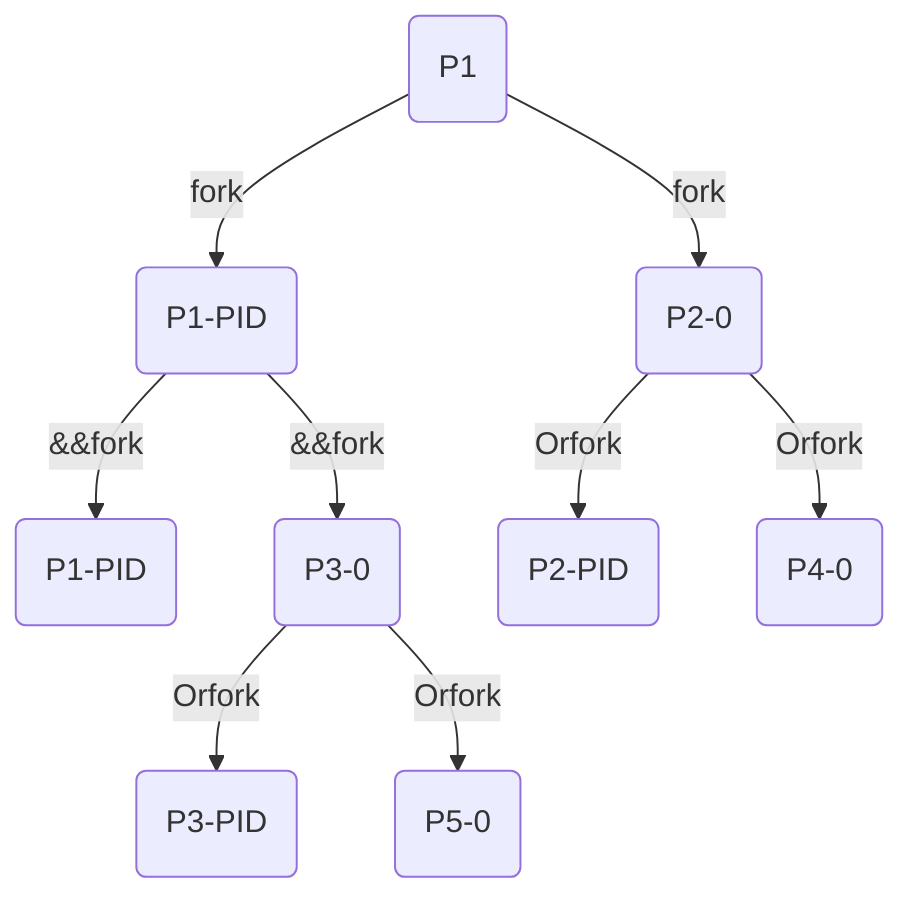
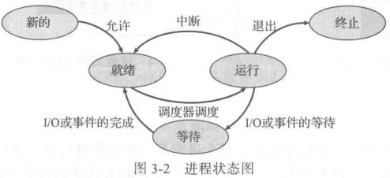
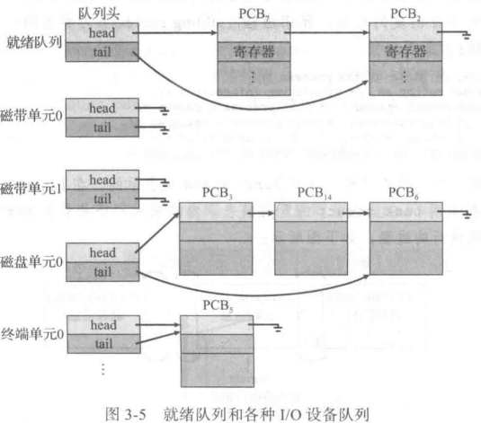
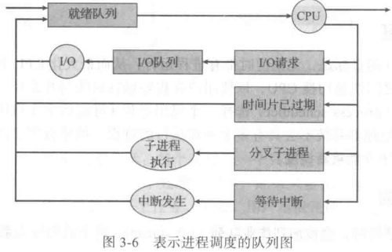
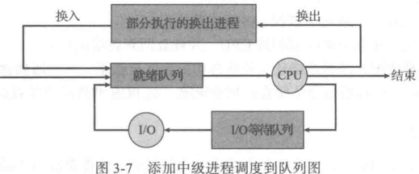
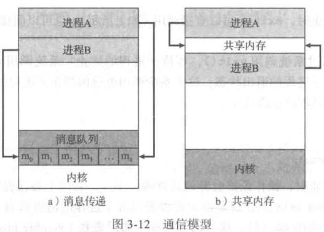
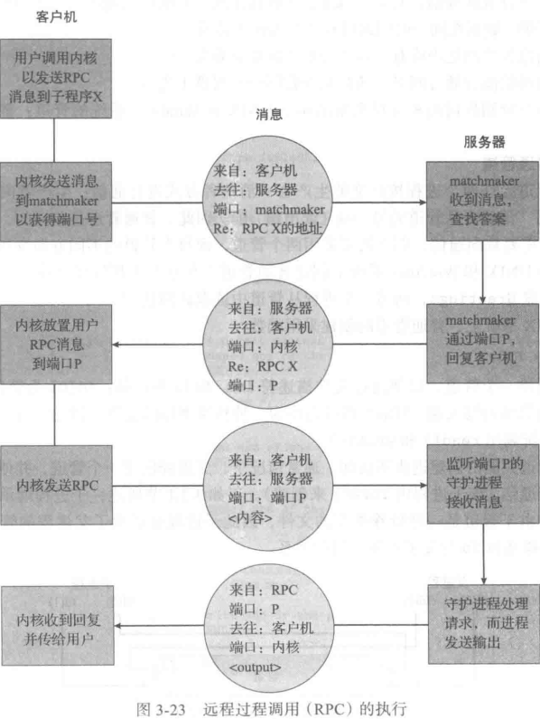

## process

>   进程是现代分时操作系统的工作单位

1.  进程堆栈
2.  数据段
3.  堆

### UnixAPI

#### `fork`

>   ```C
>   #include <sys/types.h>
>   #include <unistd.h>
>   
>   pid_t fork(void);// create child process AKA process clone
>   ```
>
>   如果创建成功 父子进程各有一个返回值
>
>   相当于进程链表 父进程的fpid指向子进程pid  因为子进程没有子进程，所以其fpid为0
>
>   返回值
>
>   | 负值 | 创建失败(错误信息在`errno`) |
>   | ---- | --------------------------- |
>   | 0    | 子进程返回值                |
>   | 正值 | 父进程返回值(子进程PID)     |
>
>   可以通过 `getpid()` 获得PID
>
>   可以通过 `getppid()` 获得父进程PID

父子进程数据共享情况

| 全局变量 | 栈区(局部变量) | 堆区(动态开辟) | 文件           |
| -------- | -------------- | -------------- | -------------- |
| 不共享   | 不共享         | 不共享         | 共享文件偏移量 |


```C
#include <stdio.h> 
#include <unistd.h>  
int main(int argc, char* argv[])  
{  
   fork();
   fork() && fork() || fork();// (fork()&&fork())||fork();
   fork();
    /*
    printf("parent : %d\tself : %d\n",getppid(),getpid());
    wait(NULL);
    */
   return 0;
} // 总共有 20 个进程(包括main)
```

第一次 `fork` 后 总共有两个进程

最后一次 `fork` 后 进程翻倍

所以只针对最开始的某一个进程观察 `fork()&&fork()||fork();` 执行情况



运行结果

```
parent : 9      self : 191
parent : 191    self : 196
parent : 194    self : 195
parent : 191    self : 194
parent : 195    self : 201
parent : 192    self : 198
parent : 198    self : 203
parent : 8      self : 193
parent : 198    self : 202
parent : 193    self : 204
parent : 192    self : 199
parent : 202    self : 206
parent : 8      self : 192
parent : 192    self : 208
parent : 199    self : 207
parent : 194    self : 200
parent : 199    self : 205
parent : 8      self : 197
parent : 205    self : 209
parent : 197    self : 210
```

#### clone

```C
/* Prototype for the glibc wrapper function */
#define _GNU_SOURCE
#include <sched.h>
int clone(int (*fn)(void *), void *child_stack,
          int flags, void *arg, ...
          /* pid_t *ptid, void *newtls, pid_t *ctid */ );
```


#### exec

>   `exec`函数会取代执行它的进程
>
>   如果执行失败 会返回失败信息(`perror`) 并归还进程执行

>   在 `fork` 的子进程执行 `exec` 时 若是执行失败 用 `exit` 退出子进程

```C
#include <unistd.h>  
// exec[lv][pe]?
// 执行文件 命令参数 环境变量
// file -- command like echo
// path -- absolute path command like /bin/echo
int execl(const char *path, const char *arg, ...);  
  
int execlp(const char *file, const char *arg, ...);  
  
int execle(const char *path, const char *arg, ..., char *const envp[]);  
  
int execv(const char *path, char *const argv[]);  
  
int execvp(const char *file, char *const argv[]);  
  
int execve(const char *path, char *const argv[], char *const envp[]);
```

| postfix | meanings                                               |
| ------- | ------------------------------------------------------ |
| **e**   | 参数指定环境变量部分                                   |
| **p**   | 默认命令路径使用 `$PATH`                               |
| **l**   | 命令参数部分必须以 `,` 分隔  最后1个命令参数必须是NULL |
| **v**   | 命令参数部分必须是以NULL结尾的字符串指针数组的头部指针 |

##### `execv`

```bash
$ whereis echo  
echo: /bin/echo
```

```C
int main(){
    char * execv_str[] = {"echo", "execv",NULL};
    execv("/bin/echo",execv_str);
    /**
     * /bin/echo -- execv
     * /usr/bin/echo -- error
     */
    puts("error");
}
```

##### `execvp`

```C
if (fork() == 0){  
    //child process  
    char * execvp_str[] = {"echo", "executed by execvp",">>", "~/abc.txt",NULL};  
    if (execvp("echo",execvp_str) <0 ){  
        perror("error on exec");  
        exit(0);  
    }
```

##### `execve`

```C
if (fork() == 0){  
    //child process  
    char * execve_str[] = {"env",NULL};  
    char * env[] = {"PATH=/tmp", "USER=lei", "STATUS=testing", NULL};  
    if (execve("/usr/bin/env",execve_str,env) <0 ){  
        perror("error on exec");  
        exit(0);  
    }
```

##### `execl`

```C
if (fork() == 0){  
    //child process  
    if (execl("/usr/bin/echo","echo","execl" ,NULL) <0 ){  
        perror("error on exec");  
        exit(0);  
    }  
```

##### `execlp`

```C
 if (fork() == 0){  
    //child process  
    if (execlp("echo","echo","executed by execlp" ,NULL) <0 ){  
        perror("error on exec");  
        exit(0);  
    }
```

##### `execle`

```C
if (fork() == 0){  
    //child process  
    char * env[] = {"PATH=/home/gateman", "USER=lei", "STATUS=testing", NULL};  
    if (execle("/usr/bin/env","env",NULL,env) <0){  
        perror("error on exec");  
        exit(0);  
    } 
```

#### process group

>   多个同时运行的线程

线程组有主线程 主线程TID等于线程组的组TGID

进程组也有组长 组长进程PID等于进程组PGID

`ps -axj` 可以查看**PGID**

>   只要在某个进程组中一个进程存在 则该进程组就存在 这与其组长进程是否终止无关

##### job

>   `./executable`
>
>   运行了一个作业(job)/进程组(process group)

作业和进程组的唯一一个显著区分是

>   进程组中进程创建出来的进程属于进程组 而作业中进程创建出来的进程不属于作业

##### session

>   会话是一个或多个进程组的集合 可以有一个控制终端

每个会话都有一个会话leader 即创建会话的进程

>   **只有当前进程不是进程组的组长时 才能创建一个新的会话**

调用`setsid`后 该进程成为新会话的leader


### process status

1.  new
2.  running
3.  waiting
4.  ready
5.  terminated



采用 **进程控制块/任务控制块(PCB/TCB)** 表示进程

>   PCB : Process Control Block
>
>   TCB : Task Control Block

<dl>
    <dt>信息</dt>
    <dd>process state</dd>
    <dd>program counter</dd>
    <dd>CPU register</dd>
    <dd>CPU-sheduling infomation</dd>
    <dd>memory-management infomation</dd>
    <dd>accounting information</dd>
    <dd>I/O status information</dd>
</dl>

### thread

以前的模型下 进程是一个只能进行单个执行**线程(thread)**的程序

现代操作系统扩展了进程概念 能支持 执行多个线程

>   Linux 使用 C `task_struct` 表示 PCB `<linux/sched.h>`

process

1.  parent
2.  child
3.  sibling

```C
long state; /* state of the process */
struct sched_entity se; /* scheduling information */
struct task_struct *parent; /* this process's parent */
struct list_head children; /* this process's children */
struct files_struct *files; /* list of open files */
struct mm_struct *mm; /* address space of this process */
```

`task_struct` 为双向链表 内核采用一个 `current`

### schedule

>   进程进入系统时 会被加到 **作业队列(job queue)** 
>
>   就绪的进程保存在 **就绪队列(ready queue)** 链表实现
>
>   等待特定I/O设备的进程列表 称为 **设备队列(device queue)** 每个设备都有自己的设备队列



进程调度通常用**队列图(queueing diagram)**来表示

| 图形   | 图示             |
| ------ | ---------------- |
| 矩形框 | 一个队列         |
| 圆圈   | 服务队列的资源   |
| 箭头   | 系统内的进程流向 |



| 长期调度程序(long-term scheduler)                            | 从大容量储存设备的缓冲池选择进程 加到内存 以便执行 | 并不频繁 |
| ------------------------------------------------------------ | -------------------------------------------------- | -------- |
| 短期调度程序(short-term scheduler)/CPU调度程序(CPU scheduler) | 从准备执行的进程中选择进程 分配到CPU               | 必须快速 |
| 中期调度程序(medium-term scheduler)                          | 将进程从内存/CPU竞争中移出 降低多道程序程度        | `swap`   |

长期调度程序 控制 多道程序程度(degree of multiprogramming) - 内存中的进程数量

-   I/O密集型进程(I/O-bound process)
    -   执行I/O比执行计算需要花费更多时间
-   CPU密集型进程(CPU-bound process)
    -   I/O请求比较少 花费更多时间执行计算



#### context switch

>   切换 CPU 到另一个进程需要保存当前进程状态和恢复另一个进程的状态

上下文切换时 内核会将旧进程状态保存在其PCB中

上下文切换的时间是纯粹的开销 这个时间与硬件支持密切相关

### process run

创建进程称为父进程

新的进程称为子进程 形成进程树

进程有唯一的标识符(**process identifier, PID**)

>   进程 `init`(PID 为 1)是所有用户进程的父进程

>   **级联终止(cascade termination)** : 一个进程终止 它的所有子进程也应终止  通常由操作系统完成

| **zombie process** | 进程终止 但父进程未调用 `wait()` 进程标识符和它在进程表中的条目未释放 |
| ------------------ | ------------------------------------------------------------ |
| **orphan process** | 父进程未调用 `wait()` 就终止                                 |


>   \*nix将 `init` 作为孤儿进程的父进程 定期调用 `wait()` 来释放资源

### InterProcess Communication

>   IPC : InterProcess Communication

1.  information sharing
2.  computation speedup
    1.  并行执行
3.  modularity
4.  convenience

有两种基本模型

-   shared memory
    -   可以更快
-   message passing
    -   适用于较少数量的数据
    -   在分布式系统中更易实现

**共享内存**和**消息传递**



#### 共享内存

>   需要通信进程建立共享内存区域

协作进程方式 有**缓冲区**

通用范例


#### 消息传递

必备操作

-   `send(msg)`
-   `receive(msg)`

通信链路(link)

-   直接/间接通信
-   同步/异步通信
-   自动/显式缓冲

##### 直接通信

>   direct communication

需要通信的每个进程必须明确指定通信的接收者或发送者

-   `send(P,msg)` : send msg to process-P
-   `receive(Q,msg)` : receive msg from process-Q

方案链路属性

-   在需要通信的每对进程之间 自动建立链路 进程仅需知道对方身份就可进行交流
-   每个链路只与两个进程相关
-   每对进程之间只有一个链路

对称性方案 双方进程都指定对方

非对称性方案

-   `send(P,msg)` : send msg to process-P
-   `receive(id,msg)` : receive msg from any process

##### 间接通信

>   indirect communication

通过邮箱或端口接发消息

邮箱 可为 一个可存放和删除消息的抽象对象

- `send(A,message)` : 向邮箱A发送message。
- `receive(A,message)` : 从邮箱A接收message。


对于这种方案，通信链路具有如下特点:

- 只有在两个进程共享-一个邮箱时，才能建立通信链路。
- 一个链路可以与两个或更多进程相关联。
- 两个通信进程之间可有多个不同链路，每个链路对应于一个邮箱。

##### 同步

>   [non]blocking
>
>   [a]synchronous

-   阻塞发送(blockingsend) : 发送进程阻塞，直到消息由接收进程或邮箱所接收
-   非阻塞发送(nonblocking send) : 发送进程发送消息，并且恢复操作
-   阻塞接收(blocking receive) : 接收进程阻塞，直到有消息可用
-   非阻塞接收(nonblocking receive) : 接收进程收到一个有效消息或空消息

##### 缓存

队列实现的三种方法

-   零容量(zero capacity): 队列的最大长度为0; **阻塞**
-   有限容量(bounded capacity): 队列长度为有限的n; 最多只能有n个消息驻留其中
-   无限容量(unbounded capacity): 队列长度可以无限; **非阻塞**

零容量情况称为无缓冲的消息系统 其他情况称为自动缓冲的消息系统

#### examples

##### POSIX

###### 共享内存

>   实现 为 内存映射文件
>
>   通过 `shm_open()` 创建共享内存对象

```C++
shm_fd = shm_open(name,O_CREAT|O_RDRW,0666); // 创建对象
ftruncate(shm_fd,4096); // 配置对象大小 bytes
// mmap() 创建内存映射文件 返回指向内存映射文件的指针
```

```C
/**
file : producer.c
*/
#include <stdio.h>
#include <stdlib.h>
#include <string.h>
#include <fcntl.h>
#include <sys/shm.h>
#include <sys/stat.h>
#include <sys/mman.h>

int main()
{
	const int SIZE = 4096;
	const char *name = "OS";
	const char *message0= "Studying ";
	const char *message1= "Operating Systems ";
	const char *message2= "Is Fun!";

	int shm_fd;
	void *ptr;

	/* create the shared memory segment */
	shm_fd = shm_open(name, O_CREAT | O_RDWR, 0666);

	/* configure the size of the shared memory segment */
	ftruncate(shm_fd,SIZE);

	/* now map the shared memory segment in the address space of the process */
	ptr = mmap(0,SIZE, PROT_READ | PROT_WRITE, MAP_SHARED, shm_fd, 0);
	if (ptr == MAP_FAILED) {
		printf("Map failed\n");
		return -1;
	}

	/**
	 * Now write to the shared memory region.
 	 *
	 * Note we must increment the value of ptr after each write.
	 */
	sprintf(ptr,"%s",message0);
	ptr += strlen(message0);
	sprintf(ptr,"%s",message1);
	ptr += strlen(message1);
	sprintf(ptr,"%s",message2);
	ptr += strlen(message2);

	return 0;
}
```


```C
/**
file : consumer.c
*/
#include <stdio.h>
#include <stdlib.h>
#include <fcntl.h>
#include <sys/shm.h>
#include <sys/stat.h>
#include <sys/mman.h>

int main()
{
	const char *name = "OS";
	const int SIZE = 4096;

	int shm_fd;
	void *ptr;
	int i;

	/* open the shared memory segment */
	shm_fd = shm_open(name, O_RDONLY, 0666);
	if (shm_fd == -1) {
		printf("shared memory failed\n");
		exit(-1);
	}

	/* now map the shared memory segment in the address space of the process */
	ptr = mmap(0,SIZE, PROT_READ, MAP_SHARED, shm_fd, 0);
	if (ptr == MAP_FAILED) {
		printf("Map failed\n");
		exit(-1);
	}

	/* now read from the shared memory region */
	printf("%s",ptr);

	/* remove the shared memory segment */
	if (shm_unlink(name) == -1) {
		printf("Error removing %s\n",name);
		exit(-1);
	}

	return 0;
}
```

### C/S communication

1.  socket
2.  Remote Procedure Call, RPC
3.  Pipe

#### Socket

>   C/S 架构
>
>   唯一连接
>
>   只允许在通信进程间交换无结构字节流

0-1023 为标准服务端口

1.  telnet : 23
2.  ftp : 21
3.  http : 80

日期传递

```Java
import java.net.*;
import java.io.*;

public class DateClient
{
	public static void main(String[] args)  {
		try {
			// this could be changed to an IP name or address other than the localhost
			Socket sock = new Socket("127.0.0.1",6013); // connect to localhost server
			InputStream in = sock.getInputStream();
			BufferedReader bin = new BufferedReader(new InputStreamReader(in));

			String line; // read date from the socket
			while( (line = bin.readLine()) != null)
				System.out.println(line);
				
			sock.close();
		}
		catch (IOException ioe) {
				System.err.println(ioe);
		}
	}
}
```

```Java
import java.net.*;
import java.io.*;

public class DateServer
{
	public static void main(String[] args)  {
		try {
			ServerSocket sock = new ServerSocket(6013);

			// now listen for connections
			while (true) {
				Socket client = sock.accept();
				// we have a connection
				
				PrintWriter pout = new PrintWriter(client.getOutputStream(), true);
				// write the Date to the socket
				pout.println(new java.util.Date().toString());

				// close the socket and resume listening for more connections
				client.close();
			}
		}
		catch (IOException ioe) {
				System.err.println(ioe);
		}
	}
}
```


#### RPC

>   **RPC** : 交换的消息具有明确结构

>   **XDR** : eXternal Data Reprsentation
>
>   外部数据表示 为了解决大小端的问题

**RPC** 绑定问题的解决

1.  按固定的端口地址形式预先固定
    1.  编译时调用关联的固定端口
    2.  编译后 服务器无法更改服务的端口号
2.  绑定通过交会机制动态进行
    1.  操作系统在一个固定**RPC**端口上 提供**交会服务程序**或**matchmaker**
    2.  Client 发送 消息 到 交会服务程序 以请求 RPC 端口地址
    3.  得到返回端口后 RPC 调用发送端口号



可用于实现分布式文件系统(DFS)


#### Pipe

>   两个进程间通信

实现中的问题

-   管道允许单向通信还是双向通信
-   如果允许双向通信 它是半双工的(数据在同一时间内只能按一个方向传输)还是全双工的(数据在同一时间内可在两个方向上传输)
-   通信进程之间是否应有一定的关系(如父子关系)
-   管道通信能否通过网络 还是只能在同一台机器上进行

##### anonymous pipe

>   对于**UNIX**和**Windows**系统 采用普通管道的进程通信需要有父子关系

##### named pipe

Unix

>   命名管道为**FIFO** 创建后即为典型文件 只支持字节流数据
>
>   `mkfifo()` 半双工

Windows

>   允许字节流或消息流的数据
>
>   `CreateNamedPipe()` 全双工

