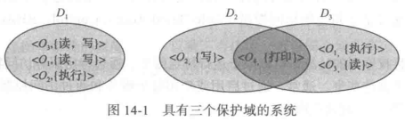

# Protection

>   保护进程免受其他进程活动干扰

## Principle

### Principle of least privilege

>   最低特权原则

规定了程序、用户甚至系统只能拥有足够特权以便执行任务

##  Protection Domain

每个计算机系统是进程和对象的一组集合

-   硬件对象(hardware object)
    -   CPU
    -   Memory
    -   Printer
    -   ...
-   软件对象(software object)
    -   File
    -   Program
    -   Semaphore
    -   ...

需要知道原则(need-to-know principle):过程只能访问允许访问的内容 即 **保护域**

>   相当于作用域

每个域为访问权限的一组集合 `<object-name,rights-set>`  可以共享权限

## Access Matrix

访问矩阵的行表示域 列表示对象

>   就像邻接矩阵

实现和具体内容没看

估计优化也还是对于稀疏矩阵的优化

## Access Control

通过基于角色访问控制(**Role-Based Access Control, RBAC**)来明确增加最低特权原则

# Security

