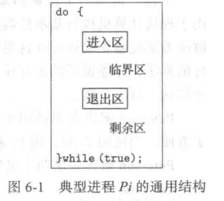
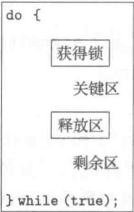
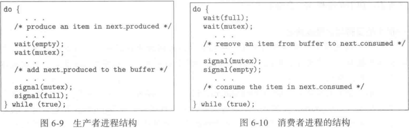
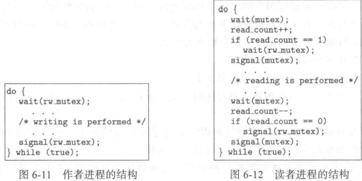
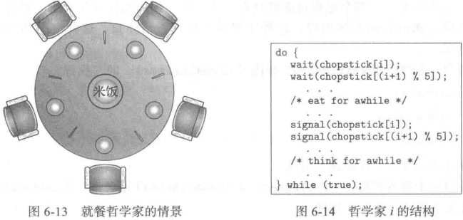
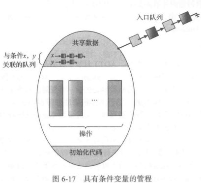
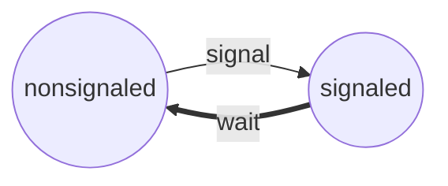

## Synchronization

**协作进程(cooperatingprocess)**能与系统内的其他执行进程互相影响

>   **竞争条件(race condition)** 多个进程并发访问和操作同一数据并且执行结果与特定访问顺序有关

协作进程的进程同步(process synchronization)和进程协调(process coordination)

### Critical section

>   临界区(critical section) : 一段代码 进程在执行该区时可能修改公共变量

当一个进程在临界区内执行时 其他进程不允许在它们的临界区内执行




临界区问题解决方案要求

| 互斥     | mutual exclusion | 临界区单一通行                                               |
| -------- | ---------------- | ------------------------------------------------------------ |
| 进步     | progress         | 选择不在剩余区执行的进程 不能无限推迟                        |
| 有限等待 | bounded waiting  | 从一个进程做出进入临界区的请求直到这个请求允许 其他进程允许进入其临界区的次数具有上限 |

方法

-   抢占式内核(preemptive kernel)
-   非抢占式内核(nonpreemptive kernel)

### Peterson 方案

>   现代计算机不能确保 **Peterson方案**的正确运行

>   适用于两个进程交错执行临界区与剩余区

两个进程 $p_0$ 与 $p_1$

使用$p_i$时 用$p_j$来表示另一个进程，即 $j==1-i$

要求共享数据项

```Java
int turn; // 表示可进入临界区进程
boolean flag[2]; // 表示准备进入临界区进程
```

code block of ***$P_i$***

```Java
do{
    flag[1] = true;
    turn = j;
    while(flag[j] && turn == j);
    
    // critical section
    
    flag[i] = false;
    
    // remainder section
    
}while(true);
```

### 硬件同步

>   基于软件的解决方案并不保证正确工作

其余方案都是基于**加锁(locking)**的 即通过锁来保护临界区

>   单处理器环境 : 在修改共享变量时**禁止中断出现**

>   现代系统 : 提供特殊硬件指令 用于检测和修改字的内容 或者 **原子(atomical)**交换两个字

#### test_and_set

>   原子执行

```C++
bool test_and_set(bool *target){ // 一种定义方式
    bool rv = *target;
    *target = true;
    return rv;
}
```

code block of ***$P_i$*** mutex implement

```C++
do{
    while(test_and_set(&lock)); // do nothing
    // critical section
    lock = false;
    // remainder
}
```

##### 另一种算法

共用数据结构

```Java
boolean waiting[n];
boolean lock;
```

只有 `waiting[i]|key==false` 时 进程 $P_i$ 才能进入临界区

```C
do {
	waiting[i]. = true;
	key = true;
	while (waiting[i] & key)
		key = test_and_set (&lock) ;
	waiting[i] = false;
    
	/* critical section */
	
    j=(i+1)%n;
	while ((j != 1) && !waiting[j])
		j=(j+1)%n;
	if(j==i)
		lock = false;
	else
		waiting[j] = false;
	/* remainder section */
}while (true);
```


#### compare_and_swap

>   原子执行 返回原始值

```C++
int compare_and_swap(int *value, int expected, int new_value) {
	int temp = *value;
	if (*value == expected)
		*value=new_value;
	return temp;
}
```

`compare_and_swap(&lock,1,0)` 如上实现互斥

互斥实现

```C
do {
	while (compare. and. swap(&lock, 0, 1) != 0); /* do nothing */
    // while(compare_and_swap(&lock,1,0));
	/* critical section */
	lock = 0;
	/* remainder section */
} while (true);
```

### mutex

>   软件工具解决临界区问题

互斥锁是最简单的工具 : 进入临界区前获得(`acquire()`)锁 退出时释放(`release()`)锁



定义 `acquire` 和 `release` 两者必须原子执行

```C
acquire(){
    while(!available); // busy wait
    available = false;
}
release(){
    available = true;
}
```

主要缺点 : **busy waiting**

当一个进程在临界区中 任何其他进程在进入时必须连续循环调用`acquire`

>   这种类型的互斥锁也被称为**自旋锁(spinlock)**

优点是没有上下文切换

### semaphore

>   功能类似于互斥锁 能提供更为高级的方法以便进程能够同步活动

一个信号量(**semaphore**)S是个整型变量 除了初始化外只能通过两个标准原子操作 `wait()` 和`signal()`来访问

| 函数     | 荷兰语      | 含义 |
| -------- | ----------- | ---- |
| `wait`   | proberen, P | 测试 |
| `signal` | verhogen, V | 增加 |

```Java
wait(S){
    while(S<=0); // busy wait
    S--;
}
signal(S){
    S++;
}
```

#### 使用

-   计数信号量(counting semaphore)
-   二进制信号量(binary semaphore)

>   二进制信号量类似于互斥锁

>   用于控制访问具有多个实例的某种资源

| 初值     | 资源数   |
| -------- | -------- |
| 使用资源 | `wait`   |
| 释放资源 | `signal` |

#### 实现

>   克服忙等待 : 将忙等待变成自我阻塞
>
>   `block/wakeup`

进程的重新执行通过操作`wakeup`

重新定义信号量

```C
typedef struct{
    int value;
    struct process*list;
}semaphore;

wait(semaphore*S){
    S->value--; // 先减后判断
    if(S->value<0){
        add this process to S->list;
        block();
    }
}

signal(semaphore*S){
    S->value++;
    if(S->value<=0){ // 因为是先减的 如果为正 则 blocklist 为空
        remove a process P from S->list;
        wakeup(P);
    }
}
```

#### 死锁&饥饿

>   **死锁(deadlocked)** : 多个进程无限等待一个只能由这些等待进程产生的事件

>   **无限阻塞/饥饿(indefinite blocking/starvation)** : 进程无限等待信号量

LIFO可能导致饥饿

#### 优先级的反转

**priority inversion**

>   优先级继承协议**priority-inheritance protocol** : 所有正在访问资源的进程获得需要访问它的更高优先级进程的优先级 直到它们用完了有关资源为止

### 经典同步问题

#### 有界缓冲问题

>   bounded-buffer problem

通常用于说明同步原语能力

共享的数据结构

```C
int BufferSize;
semaphore mutex=1; 			// rw_mutex
semaphore empty=BufferSize; // for load
semaphore full =0; 			// for get
```

$n$ 个缓冲区



#### 读者-作者问题

>   reader-writer problem

>   要求写入数据库具有共享数据库独占的访问权

| 第一读者-作者问题                                   | 第二读者-作者问题                     |
| --------------------------------------------------- | ------------------------------------- |
| 要求读者不应保持等待 除非作者已获得权限使用共享对象 | 一旦作者就绪 那么作者会尽可能快地执行 |

```C
semaphore rw_mutex=1; // 为读者作者共用
semaphore mutex =1; // 确保在更新变量read_count时互斥
int read_count=0;
```




```C++
// monitor version
reader
beg{
    ...
	// reader first version
	while(wc>0){ // variable
	// writer first version
    // while(wc>0||wwc>0){
        reader.wait(); // condition
    }
	++rc;
    ...
}
end{
	--rc;
    if(rc==0)
	    writer.signal();
}
writer
beg{
    while(rc>0||wc>0){
        writer.wait();
    }
    /** writer first
    ++wwc;
    while(rc>0||wc>0){
    	writer.wait();
    }
    --wwc;
    */
    ++wc;
}
end{
    --wc;
    reader.signalAll();
    writer.signal();
}
```


#### 哲学家就餐

>   dining-philosophers problem



[管程方案](#monitor-plan)

### monitor

>   管程 : 重要 高级的同步工具
>
>   **确保每次只有一个进程在管程内处于活动状态**

monitor type belongs to ADT(Abstract Data Type)

```C
monitor __m{ // only one thread can access the monitor at the same time
    /* shared variable declarations */
    function p1(...){
        ...
    }
    function p2(...){
        ...
    }
    ...
    initialization_code(...){
        ...
    }
}
```


提供一组自定义的在管程内互斥的操作

定义附加的同步机制 : 可由**条件(condition)结构**来提供

定义多个 condition 变量 只有操作`wait()`和`signal()`可以调用

`condition x,y;`

>   条件变量相当于**阻塞队列**



`x.wait()` 挂起一个进程

`x.signal()` 被进程P调用时 x 上有一挂起线程Q

-   **唤醒并等待(signal and wait)**:进程P等待直到Q离开管程或者等待另一个条件
-   **唤醒并继续(signal and continue)**:进程Q等待直到P离开管程或者等待另一个条件

#### monitor-plan

>   哲学家就餐的无死锁解答

```C++
monitor DiningPhilosophers{ // 可能饿死
    enum{THINKING,HUNGRY,EATING} state[5];
    condition self[5];
    void pickup(int i){
        state[i] = HUNGRY;
        test(i);
        if (state[i] != EATING)
            self[i].wait();
    }
    void putdown(int i){
        state[i] = THINKING;
        test((i + 4) % 5);
        test((i + 1) % 5);
    }
    void test(int i){
        if ((state[(i + 4) % 5] != EATING) &&
            (state[i] == HUNGRY) && (state[(i + 1) % 5] != EATING))
        {
            state[i] = EATING;
            self[i].signal();
        }
    }
    initialization_code(){
        for (int i = 0; i < 5;++i)
            state[i] = THINKING;
    }
}
```


#### semaphore-monitor-plan

>   用信号量实现管程
>
>   `P` and `V`

#### thread reboot

当多个线程挂起在条件x上 有进程执行`x.signal()` 如何选择挂起进程

最简单:FCFS

使用**条件等待(conditional-wait)**结构来调度

`x.wait(priority)`

执行wait时 添加优先值

执行`x.signal`重新启动最小优先值的进程

```C++
monitor ResourceAllocator{
    boolean busy;
    condition x;
    void acquire(int time){
        if (busy)
            x.wait(time);
        busy = true;
    }
    void release(){
        busy = false;
        x.signal();
    }
    initialization_code(){
        busy = false;
    }
}
```


### Examples

#### volatile

>   防止编译器对代码进行优化
>
>   带有读写屏障 会导致cache失效

`volatile` 指定编译器不对该变量操作优化 将其前后优化隔离

#### Windows

>   多线程内核 支持实时应用和多处理器

-   单处理器系统:暂时屏蔽一些中断
-   多处理器系统:自旋锁保护全局资源

>   **Windows**提供调度对象(dispatcher object)

**事件(event)**类似于条件



临界区对象(critical-section object)为用户模式互斥锁

#### Linux

>   Linux内核最简单的同步技术为**原子整数(atomic integer)**`atomic_t`

```C++
atomic_t counter;
int value;
atomic_set(&counter,5); // =5
atomic_add(10,&counter);// +=10
atomic_sub(4,&counter); // -=4
atomic_inc(&counter);	// ++
value=atomic_read(&counter);//12
```

##### mutex

>   `mutex_(un)lock`
>
>   不可用则休眠

提供自旋锁和信号量

|            | 单处理器                        | 多处理器   |
| ---------- | ------------------------------- | ---------- |
| `wait/P`   | 禁止内核抢占(`preempt_disable`) | 获得旋转锁 |
| `signal/V` | 启用内核抢占(`preempt_enable`)  | 释放旋转锁 |

每个系统任务都有一个`thread_info`

-   preempt_count(任务占有锁数量)

#### Solaris

-   条件变量
-   信号量
-   [读写锁](#rwlock)
-   [自适应互斥锁](#AdaptiveMutex)
-   [十字转门](#turnstile)

###### rwlock


##### AdaptiveMutex

保护访问每个临界数据项

##### turnstile

一个队列结构 包含阻塞在锁上的线程

#### Pthreads

>   Pthreads API 只能被用户级别程序员使用 不能用于任何特定内核

-   互斥锁
-   条件变量
-   读写锁

##### 互斥锁

>   正确返回0

```C++
#include<pthread.h>
pthread_mutex_t mutex;

pthread_mutex_init(&mutex,NULL); // create mutex lock

pthread_mutex_lock(&mutex); // acquire
/*
	critical section
*/
pthread_mutex_unlock(&mutex); // release
```

##### 信号量

-   named semaphore
-   unnamed semaphore

命名信号量在文件系统中具有实际名称 能被多个不相关进程共享

```C++
#include<semaphore.h>
sem_t sem;
sem_init(&sem,/* shared level */0,/* init value */1);
sem_wait(&sem); // wait
sem_post(&sem); // signal
```


### Substitution

#### 事务内存

>   **transactional memory**

>   **内存事务(memory transaction)** 是一个原子的内存读写操作序列

```C
void update(){ // mutex or semaphore
    acquire();
    /* modify shared data */
    release();
}

void update(){ // transaction
    atomic{
        /* modify shared data */
    }
}
```

-   STM 软件
-   HTM 硬件

#### OpenMP

>   `#pragma omp critical` 标记临界区

比互斥锁更容易

#### FP

>   没有 race condition 和 deadlock


