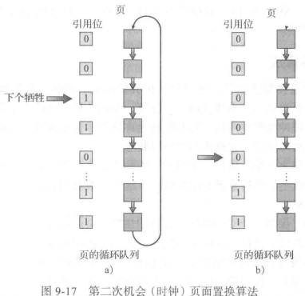

## VirtualMemoryManage

>   虚拟内存将用户逻辑内存与物理内存分开

>   进程的**虚拟地址空间(virtual address space)**:进程在内存存放的逻辑视图

### demand paging

从磁盘加载可执行程序到内存

-   在程序执行时将整个程序加载到物理内存
-   仅在需要时才加载页面
    -   请求调页
    -   常用于虚拟内存系统

请求调页系统类似于具有交换的分页系统

采用**惰性交换器(lazy swapper)** 除非需要 否则不交换

| 交换器   | 操纵整个进程     |
| -------- | ---------------- |
| 调页程序 | 只涉及进程的页面 |

>   调页程序不是调入整个进程 而是把那些要使用的页调入内存

>   对标记为无效的页面访问会产生**缺页错误(page fault)**

处理缺页错误

1.  检查这个进程的内部表(通常与PCB ( Process Control Block, 进程控制块) 一起保
    存) 以确定该引用是有效的还是无效的内存访问
2.  如果引用无效 那么终止进程
    1.  如果引用有效但是尚未调入页面 那么现在就应调入
3.  找到一个空闲帧(例如，从空闲帧链表上得到一个)
4.  调度一个磁盘操作 以将所需页面读到刚分配的帧
5.  当磁盘读取完成时 修改进程的内部表和页表 以指示该页现在处于内存中
6.  重新启动被陷阱中断的指令
    1.  该进程现在能访问所需的页面 就好像它总是在内存中

>   **纯请求调页(pure demand paging)**:
>
>   -   开始执行一个没有内存页面的进程
>   -   出现缺页错误 --> 调入内存
>   -   可以在没有更多缺页错误的情况下执行

支持请求调页的硬件与分页和交换的硬件相同:

-   **页表**:该表能够通过有效/无效位或保护位的特定值将条目标记为无效
-   **外存**(secondary memory)(或辅助存储):这种外存用于保存不在内存(主存)中的那些页面
    -   外存通常为高速硬盘 称为交换设备 用于交换的这部分磁盘称为**交换空间(swap space)**

### cope-on-write

>   更改时才复制新页

>   采用写时复制 注意空闲页面的分配位置
>
>   提供空闲的**页面池(page pool)**
>
>   分配时通常采用**按需填零(zero-fill-on-demand)**

`vfork`:不采用写时复制 直接挂起父进程 使用父进程的地址空间

### page replacement

>   如果没有空闲帧 那么就查找当前不在使用的-一个帧 并释放

释放:将其内容写到交换空间 并修改页表(和所有其他表)，以表示该页不在内存中

>   **采用modify/dirty bit**减少这种开销

页面置换是请求调页的基础

实现请求调页

-   帧分配算法(frame-allocation algorithm)
-   页面置换算法(page-replacement algorithm)

评估方法

针对特定内存引用串 运行某个置换算法 并计算缺页错误的数量

#### FIFO PR

>   最简单的页面置换算法

当必须置换页面时 将选择最旧的页面

用FIFO来实现 问题很大

对于引用串`1,2,3,4,1,2,5,1,2,3,4,5`

4帧的缺页错误数( 10)比3帧的缺页错误数(9)还要大

>   **Belady异常(Belady's anomaly)**:对于有些页面置换算法 随着分配帧数量的增加 缺页错误率可能会增加

#### Optimal PR

>   optimal page-replacement algorithm **OPT/MIN**

**置换最长时间不会使用的页面**

需要引用串的未来知识 难以实现 问题跟 SJF 算法差不多

#### LRU PR

>   Least-Recent-Used algorithm

**置换最长时间没有使用的页**

可当作在时间上向后看而不是向前看的最优页面置换算法

可能需要硬件支持

两种可行思路

-   计数器
    -   为页表条目关联使用时间域
    -   每次内存引用递增时钟
    -   置换最小时间页面
    -   考虑时钟溢出
-   堆栈

#### LRU-like PR

通过**引用位(reference bit)**的形式提供一定的支持

每当使用 引用位被硬件置位

##### 额外引用位

定期记录引用位获得排序信息

##### 第二次机会

>   second-chance page-replacement algorithm

基本算法是FIFO置换算法

检查引用位

-   0
    -   直接置换
-   1
    -   清除
    -   继续选择下一个页面

采用循环队列

##### advanced sc PR

将引用位和修改位作为有序对 改进二次机会算法

| (0,0) | 最近没有使用且没有修改的页面，最佳的页面置换                 |
| ----- | ------------------------------------------------------------ |
| (0,1) | 最近没有使用但修改过的页面 不太好的置换 因为在置换之前需要将页面写出 |
| (1,0) | 最近使用过但没有修改的页面 可能很快再次使用                  |
| (1,1) | 最近使用过且修改过 可能很快再次使用 并且在置换之前需要将页面写出到磁盘 |

可能需要多次循环

#### Count-based PR

为每个页面的引用次数保存一个计数器

-   最不经常使用(Least Frequently Used)
    -   置换具有最小计数的页面
    -   定期计数右移(aging)
-   最经常使用(Most Frequently Used)
    -   具有最小计数的页面可能刚刚被引入并且尚未使用

### 帧分配

每个进程的最小帧数是由体系结构决定的

最大帧数是由可用物理内存的数量决定的

#### 分配算法

-   平均分配(equal allocation)
    -   `m/n`
-   比例分配(proportional allocation)
    -   $S=\sum s_i$
        -   进程$p_i$ 虚拟内存大小 $s_i$
    -   $a_i=s_i/S\times m$
        -   进程$p_i$ 可以分配 $a_i$个帧
    -   比例策略会更改
        -   优先级
        -   优先级+内存

#### replacement

页面置换:分配帧的一个重要因素

| 置换算法                     | 特点                                       | 问题                                 |
| ---------------------------- | ------------------------------------------ | ------------------------------------ |
| 全局置换(global replacement) | 允许一个进程从所有帧的集合中选择一个置换帧 | 进程不能控制自己的缺页错误率         |
| 局部置换(local replacement)  | 要求每个进程只从自己分配的帧中选择         | 不能使用其他进程的较少使用的内存页面 |

>   全局置换通常由更好的系统吞吐量

#### NUMA

>   非均匀内存访问(Non-Uniform Memory Access):具有明显不同的内存访问时间

### 系统抖动

>   **抖动(thrashing)**:高度的页面调度活动

如果一个进程的调页时间多于它的执行时间 那么这个进程就在抖动

>   通过局部置换算法(**local replacement algorithm**)或优先权置换算法(**priority replacement algorithm**)可以限制系统抖动

#### 工作集模型

>   基于局部性假设

...

#### 缺页错误频率

>   Page-fault Frequency

设置帧上下限

### 内存映射文件

**内存映射(memory mapping)**文件:采用虚拟内存技术 将文件**I/O**作为常规内存访问

#### 基本机制

文件内存映射:将每个磁盘块映射到一个或多个内存页面

很多时候 共享内存实际上是通过内存映射来实现的

#### 内存映射I/O

一组内存地址专门映射到设备寄存器

内存映射I/O也适用于其他设备 如用于联结modem和打印机的计算机串口和并口

1.  为了通过内存映射串行端口发送一长串字节 CPU将一个数据字节写到数据寄存器 并将控制寄存器的一个位置位以表示有字节可用
2.  设备读取数据字节 并清零控制寄存器的指示位 以表示已准备好接收下一个字节
3.  接着CPU可以传输下一个字节

如果CPU采用轮询监视控制位 不断循环查看设备是否就绪 这种操作称为**程序I/O (Programmed I/O, PIO)**

如果CPU不是轮询控制位 而是在设备准备接收一个字节时收到中断 则数据传输称为**中断驱动(interrupt driven)**

### 分配内核内存

用于分配内核内存的空闲内存池通常不同于用于普通用户模式进程的列表。这有两个主
要原因:

-   内核需要为不同大小的数据结构请求内存 其中有的小于一页
    -   内核应保守地使用内存 并努力最小化碎片浪费
    -   这一点非常重要，因为许多操作系统的内核代码或数据不受调页系统的控制
-   用户模式进程分配的页面不必位于连续物理内存
    -   有的硬件设备与物理内存直接交互 
    -   即无法享有虚拟内存接口带来的便利 因而可能要求内存常驻在连续物理内存中

管理用于内核进程空闲内存的两个策略

-   [伙伴系统](#BuddySystem)
-   [slab分配](#slab)

#### BuddySystem

从物理连续的大小固定的段上进行分配

采用**2的幂分配器(power-of-2 allocator)**

| 优点 | 通过**合并(coalesce)**将相邻伙伴快速组合以形成更大分段 |
| ---- | ------------------------------------------------------ |
| 缺点 | 很可能造成分配段内的碎片                               |

#### slab

每个slab由一个或多个物理连续的页面组成

每个cache由一个或多个slab组成

每个内核数据结构都有一个cache

>   slab分配算法采用cache来存储内核对象

在Linux中 slab三种可能状态

-   full 使用
-   empty 空闲
-   partial 部分使用

分配顺序:partial->empty->(alloc slab -> cache)

两个主要优点

-   没有因碎片而引起内存浪费
-   可以快速满足内存请求

### attention

#### prepagin

>   试图阻止纯请求调页的大量最初调页

#### pageSize

-   页表大小
    -   减小页面大小 增加页表大小
    -   每个进程有自己的页表
-   读写页面所需时间
    -   传输时间和传输数量(页面大小)成正比
        -   延迟和寻道时间通常超过传输时间
    -   采用较小页面应该减少总的I/O

#### TLB reach

#### I/O & page lock

