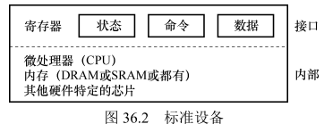
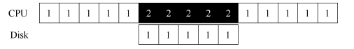
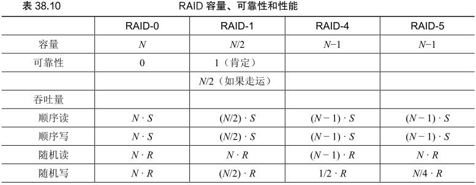
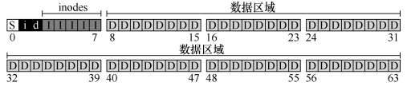
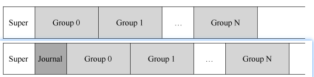
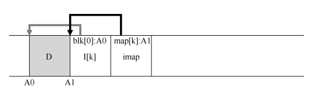

# Persistence

## I/O devices



一个标准设备


**标准协议**

一个(简化的)设备接口

-   状态(state)寄存器:可以读取并查看设备的当前状态
-   命令(command)寄存器:用于通知设备执行某个具体任务
-   数据(data)寄存器:将数据传给设备或从设备接收数据

```C
While (STATUS == BUSY) // devices polling
    ; // wait until device is not busy  
Write data to DATA register // PIO:if CPU is involved with the data movement
Write command to COMMAND register 
    (Doing so starts the device and executes the command)  
While (STATUS == BUSY) 
    ; // wait until device is done with your request 
```

>   利用中断替代轮询 允许计算与IO重叠(overlap)



数字表示不同的进程


>   中断在慢速设备上意义更大

**混合(hybrid)**策略:先尝试轮询一小段时间 如果设备没有完成操作 此时再使用中断


与设备交互的具体方式

-   特权指令
-   内存映射

### DMA

>   DMA(Direct Memory Access)

DMA 引擎是系统中的一个特殊设备 可以协调完成内存和设备间的数据传递 **不需要 CPU 介入**

处理数据传送 完成后给CPU中断

## Hard disk

>平均寻道时间是完整寻道时间的 1/3

### 调度

1.  SSTF:最短寻道时间优先
2.  SCAN:简单地以跨越磁道的顺序来服务磁盘请求
3.  SPTF:最短定位时间优先

## RAID

>   廉价/独立冗余磁盘阵列(Redundant Array of Inexpensive/Independent Disks)

评估的三个角度

1.  容量(capability)
2.  可靠性(reliability)
3.  性能(performance)

RAID简介 详细的可以看看恐龙书那里的笔记

1.  **RAID0**:条带化(两个组成一个)
2.  **RAID1**:镜像
3.  **RAID4**:奇偶校验 用一个磁盘作为奇偶校验磁盘
4.  **RAID5**:旋转奇偶校验 将奇偶校验磁盘打散



|      | RAID0 | RAID1 | RAID4 | RAID5 |
| ---- | ----- | ----- | ----- | ----- |
| 读   | T     | T     | T     | T     |
| 写   | T     | T     | 2T    | 2T    |

## File

>   文件就是一个线性字节数组 每个字节都可以读取或写入

文件的低级名称通常为inode

>   删除文件:通过`unlink` 删除文件在目录下的链接


>   `strace` 跟踪程序的系统调用


>   `fsync` 强制将所有脏数据写入磁盘

### **目录(Directory)**

包含<filename,inode>的列表

-   `opendir`
-   `readdir`
-   `closedir`
-   `mkdir`
-   `rmdir`


可以一次读取一个目录条目 并打印目录中每个文件的名称和 inode 编号

```C
int main(int argc, char *argv[]) {  
    DIR *dp = opendir(".");  
    assert(dp != NULL); 
    struct dirent *d; 
    while ((d = readdir(dp)) != NULL) { 
        printf("%d %s\n", (int) d->d_ino, d->d_name); 
    } 
    closedir(dp);  
    return 0; 
}
```

### FileSystem

-   数据结构(data structure)
-   访问方式(access method)


文件系统的磁盘分区

1.  superblock 关于特定文件系统的信息
2.  allocation structure--free list/bitmap
3.  metadata-inode table
4.  user data



### inode

>   index node


现代系统采用动态划分(dynamic partitioning)方法

>   许多现代操作系统将虚拟内存页面和文件系统页面集成到统一页面缓存中(unified page cache)

静态划分(static partitioning):固定比例大小内存作为缓存

## FFS

考完再看 很应用的东西

**A Fast File System for UNIX**

## Crash Consistency

1.  fsck
2.  journaling
3.  软更新
4.  copy-on-write
5.  基于反向指针的一致性(Backpointer-Based  Consistency，BBC)

### FSCK

文件系统检查程序(file  system  checker):克服磁盘结构不一致状态

-   超级块：fsck 首先检查超级块是否合理 主要是进行健全性检查 例如确保文件系统大小大于分配的块数
-   空闲块：接下来 fsck 扫描 inode、间接块、双重间接块等 以了解当前在文件系统中分配的块
    -   它利用这些知识生成正确版本的分配位图
    -   因此 如果位图和 inode之间存在任何不一致 则通过信任 inode 内的信息来解决它
    -   对所有 inode 执行相同类型的检查 确保所有看起来像在用的 inode 都在 inode 位图中有标记
-   inode 状态：检查每个 inode 是否存在损坏或其他问题
    -   例如 fsck 确保每个分配的 inode 具有有效的类型字段{即常规文件、目录、符号链接等}
    -   如果 inode 字段存在问题 不易修复 则 inode 被认为是可疑的 并被 fsck 清除 inode 位图相应地更新。
-   inode 链接：fsck 还会验证每个已分配的 inode 的链接数
    -   链接计数表示包含此特定文件的引用{即链接}的不同目录的数量
    -   为了验证链接计数 fsck 从根目录开始扫描整个目录树 并为文件系统中的每个文件和目录构建自己的链接计数
    -   如果新计算的计数与 inode 中找到的计数不匹配 则必须采取纠正措施 通常是修复 inode 中的计数
    -   如果发现已分配的 inode 但没有目录引用它 则会将其移动到 **lost + found** 目录
-   重复：fsck 还检查重复指针 即两个不同的 inode 引用同一个块的情况
    -   如果一个inode 明显不好 可能会被清除
    -   或者 可以复制指向的块 从而根据需要为每个inode 提供其自己的副本。 
-   坏块：在扫描所有指针列表时 还会检查坏块指针
    -   如果指针显然指向超出其有效范围的某个指针 则该指针被认为是“坏的” 
    -   例如 它的地址指向大于分区大小的块。在这种情况下 fsck 不能做任何太聪明的事情。它只是从 inode 或间接块中删除{清除}该指针。 
-   目录检查：fsck 不了解用户文件的内容
    -   但是 目录包含由文件系统本身创建的特定格式的信息
    -   因此 fsck 对每个目录的内容执行额外的完整性检查 确保“.”和“..”是前面的条目 目录条目中引用的每个 inode 都已分配 并确保整个层次结构中没有目录的引用超过一次

>   性能随着RAID的增加 越来越差

### Journaling

预写日志(write-ahead  logging)

>   更新磁盘时 在覆写结构之前 首先写下一点小注记（在磁盘上的其他地方 在一个众所周知的位置）描述将要做的事情



**ext2**与带日志的**ext3**

#### data journaling

事务完成后添加检查点(checkpointing)

操作顺序

1.  日志写入:将事务内容写入日志 等待写入完成
2.  日志提交:将事务提交块写入日志 等待写完成(commited)
3.  加检查点:将待处理的元数据和数据更新写入最终磁盘位置

### Recovery

扫描日志 并查找已提交到磁盘的事务

重做事务


对于日志的优化

1.  添加超级块
2.  循环日志


基本协议

1.  日志写入:将事务内容写入日志 等待写入完成
2.  日志提交:将事务提交块写入日志 等待写完成(commited)
3.  加检查点:将待处理的元数据和数据更新写入最终磁盘位置
4.  释放:一段时间后 通过更新日志超级块 在日志中标记该事务为空闲

## Log-structured File System

>   LFS 日志结构文件系统

永远不会覆写现有数据 而是始终将内存段写入空闲位置


LFS使用写入缓冲(write buffering) 有足够数量的更新时 立即写入磁盘

### inode 查找

inode映射

inode map数据结构



LFS 将 inode 映射的块放在它写入所有其他新信息的位置旁边

imap 数组存储在标记为 imap 的块中

>   LFS 在磁盘上有一个固定的位置 称为检查点区域(checkpoint  region，CR)

CR包含了指向最新inode map片段的指针 定期更新

## Data Integrity and Protection

### Integrity

