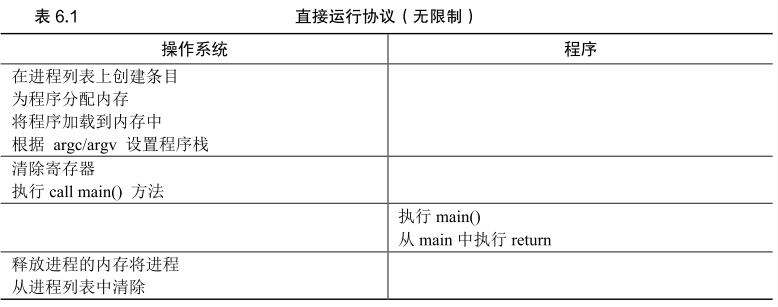
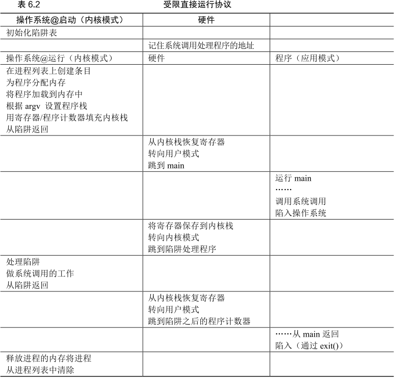
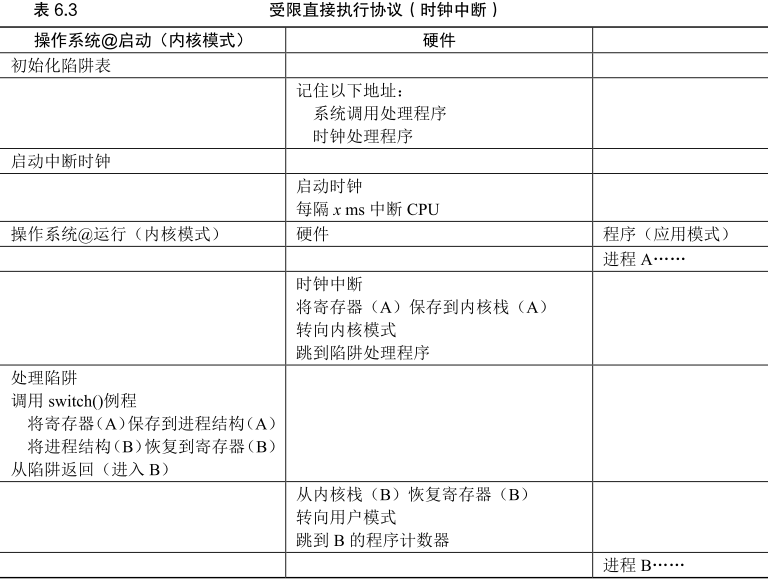
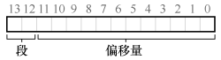
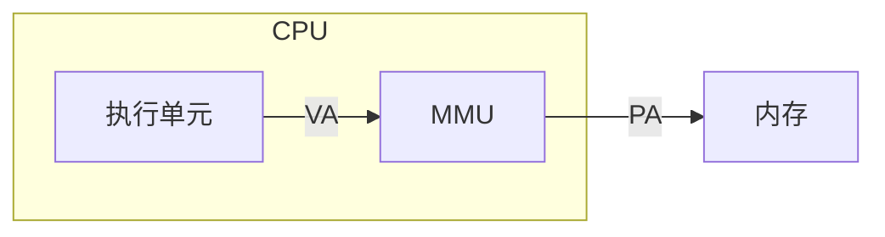

# Virtualization

## Process

>   一个正在运行的程序

>提示：分离策略和机制
>
>一个通用的设计范式是将高级策略与其低级机制分开[L+75]
>
>机制:系统的如何(how):操作系统如何执行上下文切换？
>
>策略:哪个(which):操作系统现在应该运行哪个进程？

将两者分开可以轻松地改变策略，而不必重新考虑机制，因此这是一种模块化（modularity）的形式，一种通用的软件设计原则。

## Mechanism: Limited Direct Execution

功能受限的支持 -> user(limited)/kernel mode

>   System Call=Process Call + trap(mode switch)

操作系统控制进程切换

-   协作:程序自觉`yield`
-   非协作:利用时钟中断重获控制权

## Segmentation

经典三段

1.  代码
2.  栈
3.  堆

>   段错误指的是在支持分段的机器上发生了非法的内存访问

硬件在地址转换时使用段寄存器

-   显示(explicit)方式:用虚拟地址开头几位标识不同的段

    

-   隐式(Implicit)方式:硬件通过地址产生的方式来确定段

    -   如果地址由程序计数器产生（即它是指令获取），那么地址在代码段
    -   如果基于栈或基址指针，它一定在栈段。其他地址则在堆段

对于**栈**而言 需要**硬件支持**来确定段的增长方向

支持共享--保护位(protection bit)

锁定权限为只读来节省内存

### 颗粒度

颗粒度(granularity)是指具体的详细和清晰程度。

>   `granularity=grain+clarity`

>   颗粒度越细，表示细节越详尽，越有助于了解事情的全貌
>   颗粒度越粗，表示细节越少，更多的是抽象概括。

如上的三段分发就是一种粗粒度的分段方法

支持多段需要段表(segment table)

## Page

>   解决外部碎片问题

PTE:页表项

段页式 给每个段页表 而不是给每个进程页表

>   但其实分段的位置还在 即**稀疏的段**

### Multi-level page table

>   将线性页表变成了类似树的东西

为了追踪页表的页是否有效以及位置:**页目录**(page directory)

在一个简单的两级页表中 页目录为每页页表包含了一项

它由多个页目录项（Page Directory Entries，PDE）组成

PDE（至少）拥有有效位（valid bit）和页帧号（page frame number，PFN） 类似于 PTE

PDE有效`-->`则页表上至少一页有效

### Inverted page table

保留了一个页表 其中的项代表系统的每个物理页

页表项告诉我们哪个进程正在使用此页 以及该进程的哪个虚拟页映射到此物理页

### Replace policy

>   `AMAT`:平均内存访问时间（Average Memory Access Time)

$AMAT=(P_{Hit}\cdot T_{Memory})+(P_{Miss}\cdot T_{Disk})$

>   `Belady`异常:缓存变大时 一些算法命中率下降

LRU(**Least-Recently/Frequently-Used**) 具有所谓的栈特性(stack property)

对于具有这个性质的算法 大小为 N + 1 的缓存自然包括大小为 N 的缓存的内容

先进先出(FIFO)和随机(Random)等显然没有栈特性 因此容易出现异常行为

## Supplementary

### [MMU](https://zhuanlan.zhihu.com/p/73696670)

>   Memory Management Unit 内存管理单元

-   VA:虚拟地址
-   PA:物理地址

>   相当于 MMU 实现 VA到PA的 映射

映射中的两个问题

-   映射粒度
-   映射规则:由页表描述

**TLB**:MMU中的页表缓存

Miss的查询:缓存->主存->磁盘

### [TLB](https://zhuanlan.zhihu.com/p/108425561)

>   translation lookaside buffer

>   本质是一块高速缓存

