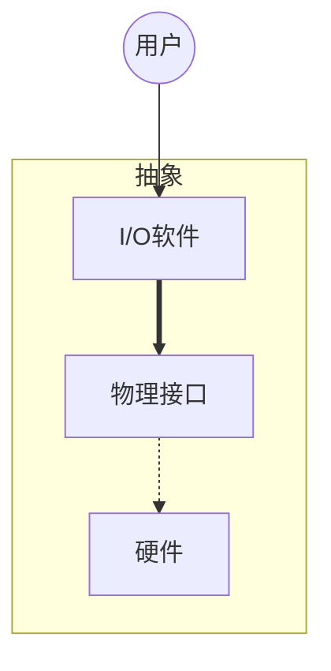

# 操作系统引论

## 作用

OS作用

1.  作为用户与计算机硬件之间的接口
2.  作为计算机上系统资源的管理者
3.  实现了堆计算机资源的抽象

## 发展过程

### 前OS时代

1.  人工操作
2.  脱机I/O

### Batch

1.  单道批处理系统(Simple Batch Processing System):内存中只有一道作业
2.  多道批处理系统(Multprogramming Batch Processing System):作业的后备队列

### 分时系统(time sharing)

特征

-   多路性
-   独立性
-   及时性
-   交互性

### 实时系统(real time)

>   将**时间**作为关键参数

根据对截止时间的不超时的要求 分为硬实时任务和软实时任务

## 基本特性

1.  [并发](#concurrency)
2.  [共享](#sharing)
3.  [虚拟](#virtual)
4.  异步

### concurrency

并行:多个事件同一时刻发生

并发:多个事件同一时段发生(宏观并行)

引入进程

>   系统中独立运行并作为资源分配的基本单位

### sharing

1.  互斥共享:一段时间内 只允许一个进程访问资源
    1.  现实中存在**假脱机**技术
2.  同时访问

### virtual

将一个物理实体变为若干逻辑对应物的功能

1.  时分复用
    1.  虚拟处理器
    2.  虚拟设备
2.  空分复用

## 主要功能

1.  CPU管理
2.  memory管理
3.  设备管理
4.  文件管理

