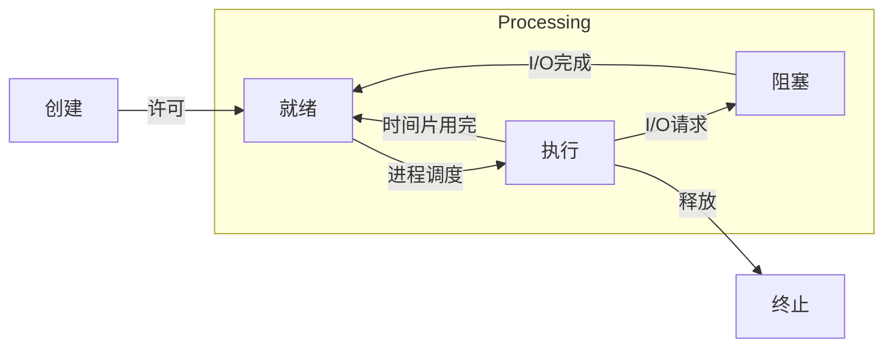

# 进程的描述与控制

## Precedence Graph

>   有向无环图

描述进程间执行的先后顺序


前驱关系用`->`表示 一个偏序二元关系

$P_j$在$P_i$完成后执行:$(P_i, P_j)\in\to$ 或 $P_i\to P_j$

$P_i$  是 $P_j$ 的直接前驱

$P_j$  是 $P_i$ 的直接后继

初始结点(Initial Node) 没前驱

终止结点(Final Node) 没后继


程序顺序执行特征

1.  顺序性
2.  封闭性
3.  可再现性

## thread

进程切换所必要的信息:**PCB 进程控制块**

为了能并发执行的独立/进程切换的恢复

>   进程是进程实体的运行过程 是系统进行资源分配和调度的一个独立单位


进程状态 CPU视角




添加**挂起**状态后

增加原语

-   Suspend
-   Active

```mermaid
graph TD
创建--许可.->活动就绪
创建--许可.->静止就绪
subgraph Processing
静止就绪--active-->活动就绪--进程调度-->执行--时间片用完-->活动就绪
执行--I/O请求-->活动阻塞--I/O完成-->活动就绪--suspend-->静止就绪
执行--suspend-->静止就绪
静止阻塞--释放-->静止就绪
静止阻塞--active-->活动阻塞--suspend-->静止阻塞
end
执行--释放-->终止
```

基本属性

1.  可拥有资源的独立单位
2.  可独立调度和分派的基本单位

实现方式

1.  内核支持线程
2.  用户级线程
3.  组合方式


### PCB

作用

1.  作为独立运行基本单位的标志
2.  能实现间断性运行方式
3.  提供进程管理所需要的信息
4.  提供进程调度所需要信息
5.  实现与其他进程的同步与通信


信息

-   进程标识符
-   CPU状态
-   进程调度信息
-   进程控制信息

### 内核支撑功能

-   中断处理
-   时钟管理
-   原语操作

### critical

resource:不能共享的资源

section:访问临界资源的代码


### 同步机制规则

-   空闲让进

-   忙则等待

-   有限等待:应保证在有限时间能进入临界区

    >   防止饥饿就好

-   让权等待:不能进入临界区时 应立即释放处理机

    >   不一定 busy-wait是一定程度允许的

### 信号量

1.  整形信号量:定义为一个用于表示资源数目的整型量S 仅能通过`wait`和`signal`操作(busy-wait)
2.  记录型信号量:不存在忙等
3.  AND同步机制:将进程在整个运行过程中需要的所有资源 一次性全部地分配给进程 待进程使用完后再一起释放
4.  信号量集:对多次PV操作的集合

### 管程

>   一个管程定义了一个数据结构和能为并发进程所执行(在该数据结构上)的一组操作 这组操作能同步进程和改变管程中的数据

管程由四部分组成

-   管程的名称
-   局部于管程内部的共享数据结构说明
-   对该数据结构进行操作的一组过程
-   对局部于管程内部的共享数据设置初始值的语句

### 条件变量

管程的同步工具

### 进程通信

1.  共享存储
    1.  基于共享数据结构
    2.   基于共享存储区
2.  消息传递
    1.  原语:send/receive
3.  管道通信
4.  C/S--`socket`

